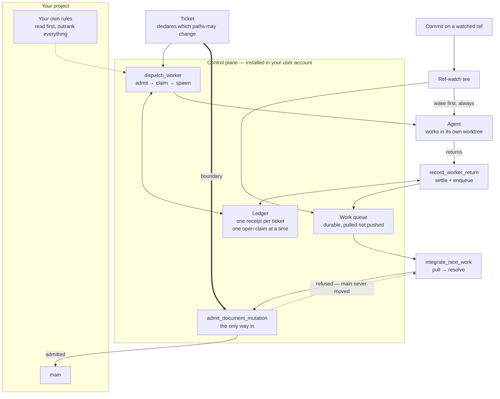

# Johnny AI Skill

A local-first control plane for structured, traceable and safer AI-assisted software development with Codex and Claude Code.

It governs how an AI agent works on your project — which stage it is in, what it is allowed to touch, what evidence it must produce before a change is integrated — without becoming part of your project.

## What it will not do to your repository

This is the claim the whole design exists to keep, so it is stated first and precisely.

Johnny AI Skill installs **into your user account**, never into the project you point it at. Your repository receives no `.johnny` directory, no manifest, no runtime, no cache, no worktree, no dependency and no import. It is not an MCP server, a hook, a CI step, a submodule or a package.

Consequently your project's own `AGENTS.md`, `CLAUDE.md`, security policy, test policy and Git policy stay authoritative. This plugin is an outside control plane that helps an agent choose a safe next step; when your project already declares a rule, that rule wins. Remove the plugin and your build, tests, deployment, dependencies and history are exactly what they were.

## How the loop is closed

Work reaches your default branch through exactly one door, and that door reads the boundary the ticket declared before any agent started.



Three properties are what the shape is for:

- **The gate performs the merge itself.** A refusal is therefore provable — a candidate that touches an undeclared path leaves `main` exactly where it was, rather than being merged and reported on afterwards.
- **The claim precedes the spawn.** The record exists before the thing it records, so an agent can never be running against a ticket with no durable trace of who holds it. A failed spawn settles its own claim in the same call that reports the failure.
- **The queue is pulled, never pushed.** Nothing has to detect whether a session is busy, and nothing interrupts one; a consumer takes the next item when it finishes the current one. That is an event, not a timer.

## Install

There are two levels. Start with the first.

### Level 1 — skills only (any platform)

This gives you the governed workflow: the takeover skill, the reusable-module selector, and the routing that decides which reference an agent must read before acting. Pure Markdown, nothing to run.

Run these outside any work project, in your personal terminal:

```bash
claude plugin marketplace add johnnyliu365-sys/Johnny_AI_Skill
```

```bash
claude plugin install johnny-ai-skill@johnny-ai-skill --scope user
```

Restart Claude Code, or type `/reload-plugins` in a running session.

If `claude` is not on your `PATH`, the CLI lives at `%APPDATA%\Claude\claude-code\<version>\claude.exe` — that path carries a version number and changes when Claude Code updates.

For Codex, the same repository root is read through `.codex-plugin/`; invoke the skills by name as shown under **Using it** below.

### Level 2 — full bundle with the Router runtime (Windows only)

The runtime — the ledger, the work queue, the document gate, the commit-event runner — is Windows-only today. It depends on `pywin32` and on Windows exclusive file locking for its cross-process guarantees. The skills in level 1 work anywhere; this level does not.

1. Download both files from the [latest release](https://github.com/johnnyliu365-sys/Johnny_AI_Skill/releases/latest) into the **same folder**:
   - `johnny-ai-skill-0.4.9.zip`
   - `johnny-install.cmd`
2. Double-click `johnny-install.cmd`.

The wrapper computes the archive's SHA-256 and compares it to a digest baked into the wrapper itself. On a mismatch it stops at `DIGEST_MISMATCH` and never unpacks anything. Only after the digest matches does it extract the installer.

The installer then prints exactly what it is about to do — the Python it will use, the version constraint, and every dependency with its pinned version and artifact hash — and waits. Nothing is downloaded or installed until you type `INSTALL`. Any other input, or none at all, is recorded as `USER_DECLINED` and the installer exits.

Everything it creates lives under `%LOCALAPPDATA%\JohnnyRouter` (override with `JOHNNY_ROOT`). It **deliberately does not modify `PATH`**, so there is no global `johnny-router` command; the entry point is a launcher script inside that root, called by full path.

Check what you have:

```powershell
powershell -ExecutionPolicy Bypass -File "$env:LOCALAPPDATA\JohnnyRouter\launcher\johnny-router.ps1" status
```

## Using it

Open your project as you normally would, then enter the takeover skill. Two entry points exist and they differ in kind:

**Deterministic** — a real slash command, so entering the governed workflow does not depend on a model deciding to load something:

```text
/johnny-ai-skill:johnny-project-takeover <what you are trying to build>
```

**Probabilistic** — natural language, for when you are describing a problem rather than deliberately entering the process:

```text
Use the johnny-project-takeover skill to take over this project safely.
```

In Codex, invoke the same skills as `$johnny-project-takeover` and `$apply-reusable-modules`.

### What actually happens

The skill reads your project's own governing files first. If your project declares rules, those rules apply and the plugin's workflow is not used. Only when a project has established nothing does the bundled workflow apply as a fallback — and it says so when it does.

It then locates the current stage, reads **only** the one reference that stage's routing row names, and returns a single next action with a typed continuation. If the required inputs for that stage do not exist yet, it stops and asks you rather than inventing them. A fresh empty directory, for instance, halts at intake with `OWNER_INPUT_REQUIRED` and a list of exactly what it needs from you — it will not scaffold a project into existence on a guess.

Reading one reference instead of the whole library is the point: the routing exists to keep context small, which is what makes the governance affordable.

### The two skills

| Skill | What it does |
| --- | --- |
| `johnny-project-takeover` | Enter or resume a project through the governed workflow: locate the stage, load the one reference that stage needs, return one next action. |
| `apply-reusable-modules` | Select the smallest safe set of `READY` modules from the catalog. It selects; it never copies anything into your project on its own. |

## Uninstall

The same launcher removes everything it installed:

```powershell
powershell -ExecutionPolicy Bypass -File "$env:LOCALAPPDATA\JohnnyRouter\launcher\johnny-router.ps1" uninstall
```

It stops any running runner, cancels subscriptions, removes the ledger, receipts, queue, telemetry, venv and launcher, then removes the registered plugin and verifies its absence.

Removing the plugin from the Codex or Claude Code UI alone removes only what that host can see; it cannot claim the Johnny runtime is gone. Use the launcher.

Re-running the installer while an install exists is refused with `VENV_ALREADY_PRESENT` and touches nothing — uninstall first, then reinstall.

For a skills-only install:

```bash
claude plugin uninstall johnny-ai-skill@johnny-ai-skill --scope user
```

```bash
claude plugin marketplace remove johnny-ai-skill --scope user
```

## What the control plane holds, and what it refuses to hold

The Router is a metadata-only control plane. Policy source text crosses its boundary as typed metadata inside an ephemeral scope and is never stored, echoed, or returned — so pointing this at a repository does not hand its contents to the plane that governs it.

A dispatch response is produced only from a live pending descriptor owned by the same Router, bound to a reviewed ticket, its handoff receipt, the commits and a named implementation owner. A descriptor that is forged, replayed, missing or mismatched produces no response and no capability, rather than a degraded one.

The delivery stage stays `POC` until an approved artifact and change record say otherwise. `MVP` and `COMMERCIAL` are profile-gated stages that exist in the history; neither is an active product objective the plugin may infer for itself from how the work is going.

## Honest limits

This project's own rule is that a mechanism which does not exist must not be described as if it does. So:

- **The runtime is Windows-only.** Skills are portable; the Router is not.
- **The work queue is durable, not timely.** An idle consumer has no "finished" boundary to arrive at, so work enqueued while nothing is running waits until the next piece of work completes. There is no timer pretending otherwise.
- **Commit triggers are queued, not yet acted on.** A commit on a watched ref lands in the queue as a `COMMIT_TRIGGER` item and the consumer defers it by name. What to *do* with it is not defined yet.
- **Liveness is discovered, not detected.** A worker that dies leaves a claim that surfaces when someone reads the ledger. There is no polling, no heartbeat and no timeout, by design — so "nobody noticed for an hour" is a possible outcome.
- **Redispatch requires a compensated claim.** A receipt that was never claimed refuses revocation rather than being waved through.

## Reading further

| Document | What it covers |
| --- | --- |
| [`AGENTS.md`](AGENTS.md) | The startup order every agent host reads first. |
| [`Workflow.md`](Workflow.md) | The stages, their routing rows, and the typed continuations. |
| [`CodeReview.md`](CodeReview.md) | Review entry, evidence requirements and finding routing. |
| [`modules/tickets/TEMPLATE.md`](modules/tickets/TEMPLATE.md) | The ticket format — fields are fixed, not improvised. |
| [`modules/tickets/PITFALL-REGISTER.md`](modules/tickets/PITFALL-REGISTER.md) | Failure families this project has actually hit, with the evidence. |
| [`doc/runbooks/live-verification-047.md`](doc/runbooks/live-verification-047.md) | The end-to-end run on a real install, line by line, including which step was performed by whom. |

Release notes for each version are on the [releases page](https://github.com/johnnyliu365-sys/Johnny_AI_Skill/releases).

## License

[Apache License 2.0](LICENSE).
