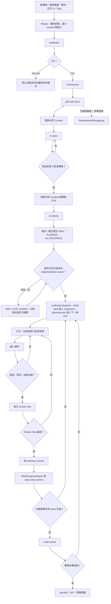
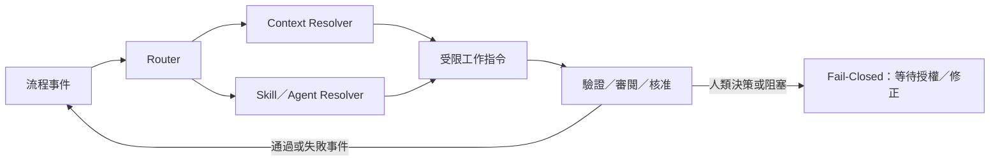

# AI 協作工程工作標準流程

> 本檔是專案唯一的 AI 工作標準來源，定義需求釐清、規格、工單、實作、審閱與交接的順序、授權閘門與完成條件。`AGENTS.md` 只能索引本檔，不得覆寫或建立競爭流程。

## 本次 Bootstrap 邊界

本次規範建立只可修改 `AGENTS.md`、`Workflow.md` 與 `CodeReview.md`；不得新增、複製、搬移或刪除其他檔案。此限制只適用於目前 Bootstrap 工作，並不否定未來在取得專案負責人明確授權後，依本流程建立正式專案產物。

<a id="workflow-flow"></a>

## 工作流程圖



主線不可跳過：

```text
流程事件 → Router → wayfinder → GO → Architecture → grill-with-docs → CONTEXT.md → to-spec → 核准
→ 旁路引用映射／已確認變更回掛 Context／CHG → to-tickets → 開立一張 ticket 為 IN_PROGRESS
→ 單一交付確認 → ticket lane implement（單一 ticket 的 TDD）＋ planning lane 下一個 Grill → commit → progress 記錄
→ code-review → handoff／UAT／部署授權
```

`wayfinder` 輸出 `NO-GO` 時停止流程，僅可在重新評估後由 `wayfinder` 重啟。

`RequirementChangeLog` 是已確認變更的旁路追溯，不取代 Context、SPEC、tickets、TDD 或任一核准閘門。

<a id="governance-document-ownership"></a>

## P0：治理文件歸屬與插件隔離

- `AGENTS.md`、`Workflow.md` 與 `CodeReview.md` 是 Johnny AI Skill 插件版本庫與安裝 bundle 的正式治理文件，必須保留在插件版本庫、隨插件版本發佈，並由安裝快取提供給插件使用。
- 這三份文件不得建立、複製、覆寫、搬移、vendor、symlink 或以其他形式部署到 target project；插件安裝、啟用、project takeover、handoff 與移除流程都不得修改 target project 的 `.gitignore` 來隱藏或管理這三份文件。
- target project 如需自己的 Agent、流程或 Code Review 規範，必須建立並維護 target-owned、target-versioned 的專案文件；不得引用插件安裝快取路徑、不得把本插件三份治理文件當成 target project 的正式產物，也不得形成對插件的 runtime、CI、hook、import、submodule 或 symlink 依賴。
- 移除或停用插件後，只移除插件能力與對這三份插件治理文件的存取；不得刪除或改寫 target project 的任何原始碼、設定、資料或正式文件。
- `.gitignore` 不是隔離、授權、文件歸屬或執行邊界，不得用來取代上述插件與 target project 的所有權分離。

## 專案啟用與唯一來源

在任何實作前，專案負責人應指定下列唯一來源。未指定時，不得直接進入實作。

| 類別 | 唯一位置 | 用途 |
| --- | --- | --- |
| 工作流程 | `Workflow.md` | 工作順序、授權閘門與交付規則。 |
| 流程 Router | `Workflow.md#workflow-router` | 依流程狀態解析最小 context 視圖、skill／Agent 能力與唯一合法下一步。 |
| Agent 入口 | `AGENTS.md` | 索引與啟動規則。 |
| Code Review 規則 | `CodeReview.md` | Code Review 的唯一實際驗證標準與結論依據。 |
| 需求變更 | `doc/RequirementChangeLog.md` | 已確認需求／正式 UI 的變更歷程。 |
| 專案事實 | `CONTEXT.md` | 系統地圖、已確認事實、邊界與待決事項。 |
| 規格 | `modules/spec/` | 已確認功能的唯一可驗收規格。 |
| 工單 | `modules/tickets/` | 垂直切片、責任與實作順序。 |
| Element 索引 | `modules/element/<language>/<feature>/<ticket-id>/` | 型別、契約、程式碼位置與測試證據索引。 |
| 交接台帳 | `doc/WorkProgressReport.md` | commit、驗證、簽署與 handoff。 |
| 安全邊界 | `doc/security-agent-boundary.md` | Secret、Log、Provider 與事故診斷規則。 |
| 審閱報告 | `doc/reviews/` | 功能集群的正式 code review。 |

完整文件結構僅能在取得明確授權後依 `template/README.md` 建立；固定正式位置是 `modules/spec/`、`modules/tickets/` 與 `modules/element/`，不得建立 `doc/specs/`、`doc/tickets/` 或平行來源。

<a id="workflow-router"></a>

## 0. 流程 Router：事件驅動的閉迴路控制

Router 是 `Workflow.md` 的控制層，不是新的工作流程、事實來源或授權者。它在 intake、產物完成、驗證結果、核准結果與需求變更等事件後，依目前狀態重新解析「下一個唯一合法動作」。已取得初始授權的自動轉移可以持續運轉；任何需要人類承擔決策的關卡仍必須停下等待明確授權。



### 0.1 強型別 Router 契約

Router 的輸入與輸出必須是具名、可檢查的契約；不得以聊天摘要、未驗證動態物件或字串慣例猜測目前流程。

```text
ProcessStage = INTAKE | WAYFINDER | ARCHITECTURE | GRILL | CONTEXT | SPEC | TICKETS
             | IMPLEMENT | SMOKE_TEST | REVIEW | HANDOFF | BLOCKED | STOPPED

RouterEvent = INTAKE | WAYFINDER_GO | WAYFINDER_NO_GO | ACTION_COMPLETED
            | VALIDATION_PASSED | VALIDATION_FAILED
            | APPROVAL_GRANTED | APPROVAL_DENIED | REQUIREMENT_CHANGED
            | CONTEXT_REFERENCE_CLOSED | EXTERNAL_DECISION_REQUIRED
            | TICKET_DISPATCH_REQUIRED | IMPLEMENTATION_DISPATCH_CONFIRMED

RouterState = {
  project_id: ProjectId,
  stage: ProcessStage,
  authority_state: APPROVED | PENDING | DENIED | NOT_REQUIRED,
  delivery_stage: POC | MVP | COMMERCIAL,
  artifact_refs: ArtifactRef[],
  collaboration_plan?: CollaborationTopologyPlan,
  pending_dispatch?: PendingDispatchDescriptor
}

ProjectWorkflowProfile = {
  profile_id: ProfileId,
  profile_version: Version,
  delivery_stage: POC | MVP | COMMERCIAL,
  delivery_profile: COMPACT | STANDARD | HIGH_ASSURANCE,
  transition_rules: (current_stage, event) ->
    (outcome, next_stage, required_authority, required_source_kinds, eligible_capabilities)
}

ImplementationResourcePlan = {
  delivery_profile: COMPACT | STANDARD | HIGH_ASSURANCE,
  model_tier: ECONOMY | BALANCED | FRONTIER,
  implementer_count: NonNegativeInt,
  independent_lane_refs: ImplementationLaneRef[],
  research_support: NONE | REVIEWER_OWNED_READ_ONLY,
  assessment_ref: DeliveryAssessmentRef,
  budget_ceiling_ref: BudgetCeilingRef,
  host_capability_refs: HostCapabilityRef[]
}

RouterDecision = {
  outcome: ADVANCE | RETRY | SUSPEND | STOP,
  continuation: AUTO_CONTINUE | WAIT_FOR_HUMAN | HALT,
  next_stage: ProcessStage | null,
  required_sources: ArtifactRef[],
  context_view: ContextView | null,
  eligible_capabilities: CapabilityRef[],
  blockers: Blocker[]
}

CompletionEvidence = {
  completion_id, action_kind: DOCUMENTATION | IMPLEMENTATION | REVIEW | HANDOFF,
  artifact_references, verification_references, evidence_digest, commit_digest?,
  emitted_event: ACTION_COMPLETED
}

ImplementationHandoff = {
  handoff_ref, ticket_ref, approved_spec_ref, context_reference_metadata, acceptance_refs, tdd_refs,
  frontend_composition_ref?, project_id, implementation_task_id, workspace_binding_ref,
  worktree_ref, control_owner, implementation_owner, reviewer
}

TicketProposal = {
  ticket_ref, state: PLANNED | IN_PROGRESS, implementation_owner, proposal_revision,
  dispatch_question_id
}

PendingDispatchDescriptor = {
  ticket_ref, proposal_revision, dispatch_question_id, implementation_owner,
  reviewed_handoff_ref, ticket_docs_commit, handoff_docs_commit,
  project_id, implementation_task_id, workspace_binding_ref, worktree_ref,
  event_correlation_id
}

ApprovedDispatchArtifact = {
  project_id, ticket_ref, reviewed_handoff_ref, implementation_owner, implementation_task_id,
  workspace_binding_ref, worktree_ref,
  ticket_docs_commit, handoff_docs_commit
}

ImplementationReturn = {
  ticket_ref, status: COMPLETED | BLOCKED | CHANGE_DETECTED,
  evidence_refs, verification_refs, evidence_digest,
  emitted_event: ACTION_COMPLETED | REQUIREMENT_CHANGED
}

ContextReference = {
  source_context: ArtifactRef,
  source_revision: RevisionRef,
  source_span: ContextSpanRef,
  side_context_id: SideContextId,
  consumer_fingerprint: ConsumerFingerprint,
  target_artifact: ArtifactRef,
  status: OPEN | CLOSED | INVALIDATED
}
```

`ArtifactRef` 只可指向既有的唯一正式來源；`ContextView` 是一次工作所需的短暫、可重建視圖，不是第二份 `CONTEXT.md`。`CapabilityRef` 表示可被 router 選擇的 skill、Agent profile 或工具能力，並非授予未核准權限。`ContextReference` 是一次旁路引用的追溯邊，不是內容回寫或另一份 Context。

`CompletionEvidence` 與 `ImplementationHandoff`／`ImplementationReturn`、`TicketProposal`、`PendingDispatchDescriptor` 與 `ApprovedDispatchArtifact` 只可保存不透明識別碼、revision／span、side-context ID、consumer fingerprint、驗證引用與 digest；不得保存 raw ContextPacket、原文、prompt、路徑、URI、Secret 或 PII。commit digest 只是完成證據，不能自行決定下一關。

### Metadata-only policy 與固定交付回應

Policy document 是 ephemeral source boundary。source 只能回傳 typed
`PolicyDocumentMetadata`（source ID、revision、evidence digest）；原文、
prompt、path、URI、secret、PII 與 exception detail 不得進入可序列化 Router
model、formatter、telemetry 或 error。

固定 dispatch response 不得由公開字串 builder 任意產生。Private Router
必須保留同一個 live `PendingDispatchDescriptor`，並將 reviewed ticket／
handoff 的 commit、reference 與具名 implementation-owner ID 綁定在該
descriptor 上；只有該 Router-owned pending plan 能產生固定回應與交付問題。
Dispatch admission 必須注入 typed `ApprovedDispatchArtifactRegistry`，以
ticket／handoff／implementation-owner identity 精確解析已審核的 ticket 與
handoff commit；Router 不得信任 caller 帶入的 raw handoff commit。registry
缺少精確記錄、identity 或任一 commit 不一致時，必須在建立問題、pending、
receipt 或 implementation lane 前 `HALT`。
複製或偽造 plan、任意 regex-valid identifier、缺失／replay／mismatch
descriptor、formatter exception 或輸出變更一律 `HALT`，不得產生回應或
capability。淘汰的 `TICKETS + APPROVAL_GRANTED -> IMPLEMENT` 仍為 `HALT`。

### 0.1.1 自動接續與人類等待的唯一規則

Router 不得因為任何 `SUSPEND` 一律進入長等待。每個 Decision 必須輸出唯一 `continuation`：

1. `AUTO_CONTINUE`：僅限已宣告的 `ADVANCE`／`RETRY`、完整最低來源、有效驗證、唯一 allowlisted capability 與不需要新的人類授權的情況。執行器可自動接續該單一動作，完成後以新的 `RouterEvent` 再次路由。
2. `WAIT_FOR_HUMAN`：僅限 Profile 明確標記的核准關卡、使用者決策或不可逆外部副作用。等待的 UI 必須顯示所需核准的精確原因，不得偽裝成一般故障。
3. `HALT`：缺資料、未授權、驗證失敗、服務／Provider 不可用、回應或 correlation 不合法／重播、來源超出 Context grant、預算超限、未宣告 transition、`NO-GO` 或拒絕核准時，必須停止；不得 fallback 到本機規則、猜測下一步或無限等待。

自動接續必須有明確步數／時間 safety ceiling；達上限也是 `HALT`。這只控制本流程的 capability path，不能宣稱可阻止使用者停用插件或改用其他工具。

任何完成行為（包括正式原始碼 commit 或 docs-only commit）都必須先產生 `CompletionEvidence` 與 `ACTION_COMPLETED`，再由 Router 輸出唯一 Decision。Agent 在完成這次 re-route 前不得以 commit 當作任務終點或回覆終態；合法 `AUTO_CONTINUE` 僅執行一個下一關動作後重新路由。缺失或無效證據、來源、權限、owner、capability、回應或 transition 一律為 `HALT`，不是一般等待。

### 0.2 專案 Profile 與交付成熟度

Router 核心是固定的流程執行器；每個專案的合法轉移、來源需求、核准門檻與 capability allowlist 都必須由一份已驗證的 `ProjectWorkflowProfile` 宣告。核心不得把任一產品的商業規則寫死。

`POC`、`MVP` 與 `COMMERCIAL` 是正常交付成熟度，不是跳過 `wayfinder`、Architecture、Grill、SPEC 或 ticket 的捷徑：

1. 使用者給出目標後，以 `POC` 作為初始 `delivery_stage`。POC 只驗證最小假設、可行性與明確的 GO／NO-GO；它不是可直接營運的產品。
2. POC 的證據足以支持後續投資時，專案負責人以 `REQUIREMENT_CHANGED` 提出「升級至 MVP」的目標，建立 CHG，將目標 Profile 切換為 `MVP`，再由 `WAYFINDER` 重新收斂 MVP 的使用者價值、風險、邊界和驗收條件。其後仍依序經過 Architecture、Grill、Context、SPEC、tickets 與實作門檻。
3. MVP 驗證後，如要承諾正式營運、安全、支援、可觀測性、資料治理、法規或服務等級，同樣以 `REQUIREMENT_CHANGED` 進入 `COMMERCIAL` Profile，並從 `WAYFINDER` 重走受影響的關卡。商用標準是該專案 Profile 的可驗收承諾，不由 Router 自行推論。
4. `RouterState.delivery_stage` 必須和正在使用的 Profile 相符。未有核准的 CHG、對應證據或適用 Profile 時，Router 必須 `SUSPEND`，不得把 POC 結果當成 MVP 或商用結論。

<a id="adaptive-delivery-profile"></a>

### 0.2.1 自適應交付 Profile 與實作資源

`delivery_stage` 表示 POC／MVP／COMMERCIAL 承諾；`delivery_profile` 表示本次
專案／ticket 所需的流程強度，兩者不可混用。Router 在 intake 與每張 ticket
dispatch 前，必須以具名證據評估變更面、耦合、不確定性／新穎性、失敗影響、
可逆性、驗證環境與外部效果，選擇：

- `COMPACT`：單一有界變更面、既有模式、可逆、確定性測試且無升級觸發；
  可縮短 Context／SPEC／ticket 章節，未改變架構決策時免 ADR，但需求、AC、
  owner、首次紅綠燈、受影響回歸與獨立 review 不得省略。
- `STANDARD`：跨多個本機元件、共享契約、新 adapter 或中度不確定性；使用
  正常 Architecture／Grill／Context／SPEC／ticket 與完整受影響驗證。
- `HIGH_ASSURANCE`：高影響、難以回復、新架構或正式外部邊界；加入替代方案、
  威脅／失敗矩陣、adversarial verification 與最強獨立審閱。

驗證資料缺失不得預設 `COMPACT`。認證／授權、Secret／credential、付款、
個資／受管制資料、破壞性 migration、release／deployment／signing／supply
chain、不可逆外部效果、concurrency／distributed consistency、sandbox escape、
Native Bridge／IPC／Extension capability 或 `PRIVILEGED_XSS_REVIEW` 一律強制
`HIGH_ASSURANCE`。專案大小、檔案數或程式行數不得單獨決定或降低等級。

reviewer 依 assessment 產生 `ImplementationResourcePlan`。正式原始碼工作預設
一位 implementer、無 helper；文件／唯讀工作可為零位。只有互不重疊的 ticket／
檔案 ownership、獨立 AC 與明確整合順序都成立時才可增加 lane。model tier 是
host 能力／成本選擇，不授予 authority。高搜尋量且可獨立拆分、低權限、零寫入
衝突時，reviewer 可建立一位唯讀、no-code research helper；implementation
owner 仍不得控制它或任何 Agent。

需求、風險、XSS／安全分類、耦合或驗證結果變更時必須重新評估；可自動升級，
降級則必須有完整證據，且不得刪除已要求的測試、finding 或不可變 commit。

<a id="post-poc-staging-lifecycle"></a>

### 0.2.2 POC 後 staging 開發基線

第一版 POC 通過獨立審閱並由專案負責人接受後，不得直接在其凍結來源、
正式版本記錄或預設穩定分支上繼續開發。Router 必須先產生具型別的
`StagingTransitionPlan`，精確綁定 repository identity、已接受 POC commit、
預期 staging ref 狀態、凍結版本記錄及 plan digest；只有一次明確確認可授權
該計畫內的本機 Git effect。遠端 staging 建立或 fast-forward 是另一個外部
effect，仍須獨立 authority、remote history 檢查與 SHA readback。

1. POC 未完成獨立 review、驗收或 commit 身分不唯一時，回
   `WAIT_FOR_HUMAN / POST_POC_BASELINE_REQUIRED`，不得建立後續 ticket 的
   implementation branch／worktree。
2. staging 只能建立於或 verified-fast-forward 到精確接受的 POC／既有 staging
   後繼 commit；禁止 reset、force、覆寫凍結版本、靜默解衝突或從未審閱來源
   建立 staging。
3. staging admission 成功後，所有後續功能／架構 ticket 的 expected base 與
   worktree branch 都必須衍生自當時讀回的 staging SHA。錯 ref、stale SHA、
   dirty base、diverged remote 或 ancestry 不符，必須在 source／Git／Agent
   effect 前 typed `HALT`。
4. 後續變更只可經 change control、SPEC、ticket、TDD、獨立 review 與 guarded
   integration 回到 staging；穩定版本或新 package 需另經 promotion gate，
   不得把「已合入 staging」等同「已發行」。
5. staging 是版本整合基線，不是 effect 測試沙箱。安裝、解除安裝、host、
   migration 或其他副作用仍必須在 receipt-bound disposable environment 驗證；
   測試環境不得充當 Git staging authority。
6. 專案尚無遠端或未授權 push 時，可先建立並驗證本機 staging ref，但不得
   宣稱已有遠端溫備。後續若政策要求遠端備份，缺少安全 publication 證據時
   應停在對應 promotion／publication gate。

### 0.3 Context 與能力解析規則

1. Router 先讀取 `RouterState` 與其 `artifact_refs`，再以目前 `stage`、`event`、`delivery_stage` 與授權狀態選擇最小必要來源；不得將完整共用 Context、聊天記錄或無關歷史直接複製進工作指令。
2. `ContextView` 是可持久化的 descriptor，只標明目的、來源引用、適用關卡、內容預算與失效事件；它不得含引用原文。MCP／來源 adapter 讀取出的原文只可存在於當次 `ContextPacket` 與引用 Agent 自己的 worktree，不得寫入 LangGraph state 或 checkpoint、Temporal input／history、Router state、citation ledger 或共用 Context。
3. Router 只向 Agent 顯示與當前工作相關的 capability catalog；完整 skill 內容僅在命中適用條件後載入。catalog 篩選用於降低 context 雜訊，不可單獨作為安全權限邊界。
4. Agent 的寫入、執行、外部存取與 delegation 權限，仍由其工作角色、worktree、使用者授權與安全規則決定；router 不得藉由選擇 capability 繞過這些限制。
5. 需要採用既有通用原始碼時，先以 [MODULE_CATALOG.md](library/MODULE_CATALOG.md) 或 `$apply-reusable-modules` 選擇最少 READY 模組；卡片只決定閱讀範圍，實際採用仍須在本流程的 Grill、SPEC 與 ticket 中核准。

### 0.4 旁路引用與掛回映射

旁路引用的掛回只記錄「誰在何時以哪一個一次性引用 ID，使用哪個版本的哪段 Context，支援哪一份 Grill、SPEC 或 ticket」；不得將旁路輸出、聊天紀錄或引用原文回寫、合併或複製進共用 Context。原始 Context 與正式產物仍各自維持唯一來源。

1. 每一個新的 Router event 所建立的旁路引用都必須有新的 `side_context_id`；即使是同一 Agent 再次引用同一來源段落，也不得重用先前 ID。同一 event 的重試是同一次引用，必須保留相同 ID，避免重試製造假的兩次使用紀錄。
2. `consumer_fingerprint` 必須可辨識引用者的 Agent profile／版本、worktree 與執行實例，但不得包含 Secret 或完整提示內容。`source_revision` 與 `source_span` 必須足以定位當時的原文版本與段落。
3. 引用 Agent 只可在自己的 worktree 保存本次引用過的原文段落，以及其來源、版本與 `side_context_id`；此本地紀錄是引用證據，不是正式 Context，亦不得成為其他 Agent 的共用輸入。
4. 引用結束時，Router 收到 `CONTEXT_REFERENCE_CLOSED`，以 `ContextReference` 建立或更新可重建的映射投影：`source_context + revision + span → side_context_id → consumer_fingerprint → target_artifact`。`target_artifact` 必須指向本次實際使用的 Grill、SPEC 或 ticket。
5. 該映射只保存引用關係，不授權實作、不確認事實，也不取代變更控制。若旁路工作導致事實、決策或需求改變，仍必須走 `REQUIREMENT_CHANGED`、`grill-with-docs` 與既有核准閘門。
6. 來源更新、需求改變或核准撤回時，既有引用應標示 `INVALIDATED`；下次引用必須解析新來源並產生新的 `side_context_id`，不得假定舊引用仍適用。

```text
CTX-WF-001@4#poc.cost-assumption
  ├─ SCX-20260802-001 → AGF-architecture-v2/worktree-A → GRILL-POC-001
  └─ SCX-20260802-002 → AGF-spec-v1/worktree-B         → SPEC-MVP-001
```

### 0.5 關卡路由表

| 關卡 | Router 最小必要來源 | 可選能力類型 | 合法輸出事件 |
| --- | --- | --- | --- |
| `INTAKE` | 使用者目標、唯一正式 Project Goal 與適用 Profile | 目標正規化、Profile 選擇 | `INTAKE` → `WAYFINDER` 或 `SUSPEND` |
| `WAYFINDER` | `Defined_wayfinder.md`、使用者授權與已確認產品事實 | 產品、商業、可行性評估 | `WAYFINDER_GO`／`WAYFINDER_NO_GO` |
| `ARCHITECTURE` | 已 `GO` 的 Wayfinder Shared Context、限制與風險 | 架構、成本、安全邊界 | 高階架構完成或阻塞 |
| `GRILL` | 與本次 scope 有關的需求、架構、契約、風險與既有產物 | 領域、資料、API、UI、Provider、安全分析 | 已確認事實或變更事件 |
| `CONTEXT`／`SPEC`／`TICKETS` | 當前 scope 的有效 Context、CHG、架構與核准狀態 | 規格、切片、驗收、責任分派 | 草案、核准等待或核准結果 |
| `IMPLEMENT`／`SMOKE_TEST` | 已核准 ticket、其 SPEC 章節、直接依賴契約與必要安全規則 | 強型別實作、TDD、測試、Smoke Test | 驗證通過或失敗 |
| `REVIEW`／`HANDOFF` | 完成證據、實際 diff、有效 ticket／SPEC／CHG 與 review 規則 | Code Review、交接、UAT | `APPROVED`、修正回授或等待部署授權 |

### 0.6 執行節點與 Fail-Closed

| 節點 | 唯一責任 | 可持久化資料 | 不可做的事 |
| --- | --- | --- | --- |
| Pydantic contract | 驗證 `RouterState`、`RouterEvent`、Profile、Decision 與引用映射的型別及不變量 | 強型別 descriptor | 接受未驗證的動態資料或原文進入共享狀態 |
| LangGraph | 將已驗證的 transition 組成封閉節點與 `RouterDecision`／`ContextView` descriptor | Graph state／checkpoint 的 descriptor | 讓 Agent 指定任意下一個節點，或保存 `ContextPacket` |
| OpenAI Agents SDK | 將 allowlisted `CapabilityRef` 解析為實際 Agent／skill | Capability 定義與執行結果引用 | 以 handoff 或 prompt 繞過 Router allowlist |
| Temporal | 處理 typed signal、query、人類核准等待、重試與故障恢復 | 已驗證的 event、state 與 decision descriptor | 在 durable workflow 內執行非決定性 I/O，或保存原文 |
| MCP | 只依 `required_sources` 讀取已指向的正式 URI，並在邊界正規化為 typed snippet | 來源引用與 revision | 掃描未宣告資源、以模糊搜尋補齊 Context，或把原文回寫共享狀態 |

POC 實作必須使用各框架的公開介面；不得依賴 LangGraph Pregel 私有迴圈。非決定性 I/O 一律留在 adapter／Temporal Activity 邊界，Graph 與 Temporal 的可重播狀態只保存 descriptor。

Router 可在下列條件都成立時自動發出下一個工作指令：前一關產物完整、驗證證據有效、下一關不需要新的人類授權，且 `ContextView` 與 capability 都可被完整解析。每個工作指令只可覆蓋單一合法關卡與明確 scope；完成後必須以新的 `RouterEvent` 回饋 Router，不得自行跨關卡推進。

Router 必須輸出 `SUSPEND` 或 `STOP`，而非猜測或降級繼續，當發生任一情況：

- `NO-GO`、`APPROVAL_DENIED`、未授權的外部動作，或明確要求人類決策；
- 必要正式來源、完整引用、有效核准、role／worktree owner 或能力不存在；
- 需求、權限、資料契約、安全邊界、Provider、成本上限或風險狀態衝突；
- TDD、型別檢查、Smoke Test、Code Review 或其他必要驗證失敗。

在 Bootstrap 期間，Router 僅能根據目前存在的文件輸出 route proposal；缺少正式產物時必須依本檔的唯一來源規則標示 `BLOCKED`，不得自行新增平行 context、spec、ticket 或報告。

完成事件與實作交接使用具名契約：`CompletionEvidence` 附著於 `ACTION_COMPLETED`，`ImplementationHandoff` 只攜帶核准引用、角色與證據識別，`ImplementationReturn` 只能回傳 `COMPLETED`、`BLOCKED` 或 `CHANGE_DETECTED`。後者必須發出 `REQUIREMENT_CHANGED` 並回到 Grill；commit 本身不是完成或路由決策。

<a id="discovery"></a>

## 1. 需求釐清：`wayfinder` 與 `grill-with-docs`

<a id="workflow-wayfinder"></a>

### 1.1 `wayfinder`：流程第一關

所有新專案與接管專案都必須先執行 `wayfinder`；所有 Agent 都必須依 `Defined_wayfinder.md` 的規範執行其實際工作內容。該文件是 Wayfinder 的唯一詳細定義，包含評估項目、Strict Veto、`GO`／`NO-GO` 決策、Required Output、handoff 與重跑條件；本檔只定義它在整體工作流程中的關卡位置。

Wayfinder 的輸出順序固定為「產品定位 → 可驗收前端功能切片 → 由每個切片反推後端 capability／資料管線 → 組合式設計與依賴注入邊界」。`GO` 的 Shared Context 必須包含此 Functional Architecture Brief；Architecture 只可在該輸入上選擇高階結構與技術邊界，不得由技術偏好倒推或省略使用者功能、資料 owner、UI state、Composition Root 或依賴注入替換點。

未依 `Defined_wayfinder.md` 產出決策前，不得進入 Architecture、`grill-with-docs`、SPEC、ticket 或實作。`NO-GO` 必須停止流程；`GO` 才可交付 Wayfinder Shared Context 給 Architecture Agent 建立高階架構，之後進入 `grill-with-docs`。正式 `CONTEXT.md` 仍只可依本流程的授權與唯一來源規則建立或更新。

### 1.2 `grill-with-docs`

新功能、跨模組變更、需求重定義或正式 UI 變更前，必須閱讀相關需求、既有規格、程式、測試、Context 與變更紀錄，並確認：

- 使用者可觀察結果、例外情境與驗收方式。
- 每個核心前端功能切片是否可追溯到唯一後端 use case、資料 owner／管線、讀取 projection 與回傳 UI state；任一斷點都必須列為缺口而非由 Agent 猜測。
- 領域術語、資料所有權、資料流、保存與刪除限制。
- UI、API、背景工作、快取、資料庫、Provider、權限、成本與維運影響。
- 是否以 Browser、WebView、HTML／DOM Renderer 或 JavaScript execution context 呈現不可信資料；若是，必須盤點資料來源、編碼／清理邊界、DOM sink、navigation／origin 邊界與 XSS 影響。若該 JavaScript execution context 可觸達 Native Bridge、IPC、Extension API 或其他 privileged capability，必須同時盤點全部可達宿主能力與信任邊界，並升級為 privileged XSS 風險。
- 模組責任、依賴方向、Composition Root、具名依賴注入、生命週期、test fake 與不可修改邊界。
- 替代方案、風險、回滾／forward-fix 與不做範圍。

完成後更新共同 `CONTEXT.md`；重大且難以回復的決策另以 ADR 留存。沒有明確授權時，只能提出草案或缺口，不能新增正式產物。

<a id="xss-review"></a>

### 1.3 XSS Review 強制閘門

任何使用 Browser、WebView、HTML／DOM Renderer 或 JavaScript execution context 呈現不可信資料的功能，都必須進入 XSS Review。若 JavaScript execution context 可存取 Native Bridge、IPC、Extension API 或其他 privileged capability，XSS 必須升級審查，因為影響可能從網頁 session 擴張成宿主程式能力。

Architecture／`grill-with-docs` 必須先做出下列封閉分類，並把結果帶入 Context、SPEC、ticket 與 review；不得等到實作後才補判定：

1. `XSS_NOT_APPLICABLE`：沒有不可信資料進入上述 renderer／execution context；須記錄可驗證理由。
2. `STANDARD_XSS_REVIEW`：不可信資料會進入 renderer／execution context，但該 context 無法觸達宿主 privileged capability。
3. `PRIVILEGED_XSS_REVIEW`：JavaScript execution context 可直接或間接觸達 Native Bridge、IPC、Extension API、filesystem、process、credential、host automation 或其他 privileged capability。

命中後必須凍結：不可信資料來源與 owner、每個解析／轉換／儲存／呈現階段、精確輸出 context 與 DOM sink、採用的 context-aware encoding／sanitization、禁止的 bypass API、CSP／sandbox／origin／navigation 邊界，以及可重跑的 renderer 測試方式。不得以「已 escape」、「使用框架」或單一 sanitizer 名稱取代 source-to-sink 證據。

`PRIVILEGED_XSS_REVIEW` 另須列出 JavaScript 可達的每個 bridge／IPC／extension capability、其最小權限、允許 origin／frame／caller、具名 message schema、每次呼叫的授權／驗證點、失敗行為與宿主 effect fake。Renderer 與 privileged capability 之間預設拒絕；prompt、UI 隱藏、方法命名、一般 capability 字串或前端檢查不得充當安全邊界。無法證明不可達或 fail-closed 時，不得進入實作。

<a id="change-control"></a>

## 2. 變更控制

已確認需求、正式 UI、資料契約、權限、快取、Provider 或商業規則改變時：

1. 停止受影響實作與測試；未完成 ticket 標示 `BLOCKED`，被取代產物標示 `SUPERSEDED`。
2. 讀取 `RequirementChangeLog`，避免重複採用已否決或已被取代的方案。
3. 重新執行 `grill-with-docs` 並完成影響分析。
4. 以唯一 `CHG-YYYYMMDD-NNN` 旁路登錄原規則、變更後規則、決策理由、影響範圍、PRD 索引與關聯技術方案；SPEC 建立後回填完整 SPEC ID。
5. 更新 `CONTEXT.md`：移除失效事實，保留可追溯依據。
6. 重新走 `to-spec → 核准 → to-tickets → 核准`。
7. 若 SPEC 引用共同 Context，先由各檔案 owner 回掛 SPEC ID、路徑、收斂結果、責任邊界與關聯 CHG，並以 docs-only commit 形成共同基準。
8. 只清理被新版需求取代的測試；仍有效的安全、契約與回歸測試必須保留。

<a id="specification"></a>

## 3. `to-spec`：唯一可驗收規格

每個已確認功能集群只可有一份有效 SPEC，位置為 `modules/spec/<feature>.md`。SPEC 至少包含：

- `SPEC-<PROJECT>-<FEATURE>-<YYYYMMDD>-<ULID>`、狀態、撰寫 AI／worktree／基準 commit。
- Context、PRD、CHG 與共同 Context 回掛索引。
- 問題、目標使用者、成功標準與不做範圍。
- 使用者流程、資料流、錯誤與邊界行為。
- 領域模型、資料庫、快取、API／事件、UI、Provider、權限與維運影響。
- Composition Root、公開介面、依賴方向與責任邊界。
- 測試切點、驗收條件、風險、相容性、回滾／forward-fix 與部署前提。
- [XSS Review 強制閘門](#xss-review)的分類與理由；命中時須完整記錄 untrusted source → transformation／storage → output context／DOM sink 的資料流、防護責任與驗收矩陣。`PRIVILEGED_XSS_REVIEW` 還須記錄 JavaScript → bridge／IPC／Extension API → host effect 的 capability graph、最小權限與 fail-closed 邊界。

SPEC 只能在產品負責人或使用者明確核准後進入 `APPROVED`。修訂追加修訂簽名；取代才建立新 SPEC 並標記舊 SPEC `SUPERSEDED`。ID 一經發布永不重用。

<a id="tickets"></a>

## 4. `to-tickets`：垂直切片與責任邊界

SPEC 核准且共同 Context 回掛完成後，才可建立 `modules/tickets/<feature>/`。每張 ticket 是可獨立驗證的使用者可觀察行為，禁止按前端、後端、資料庫或測試做水平切割。

每張 ticket 至少記錄：

- 對應完整 SPEC ID、章節與 AC；PRD、CHG、Context 與共同基準。
- `PLANNED`／`IN_PROGRESS`／`BLOCKED`／`DONE`／`SUPERSEDED` 狀態。
- owner、worktree、審閱者、環境、In Scope、Out of Scope 與依賴。
- 領域／應用／基礎設施／UI 影響、公開契約與實際原始碼位置。
- TDD 的正常、違規、外部失敗與回歸測試切點。
- XSS 分類及其 SPEC 引用；命中 XSS Review 時，列出有限、具名、可反向驗證的 payload／sink／navigation／storage 測試格。`PRIVILEGED_XSS_REVIEW` 必須另列每個 bridge／IPC／Extension capability 的未授權與繞過測試格。
- 驗收方法、正式環境 SOP、回滾策略與完成回寫欄位。
- 適用的 `delivery_profile`、assessment reference、實作 model capability tier、
  implementer lane 數量／彼此不重疊證據，以及 helper 是否為 reviewer-owned
  read-only。不得只寫「小專案」或「複雜工單」。

`modules/element/<language>/<feature>/<ticket-id>/` 是索引與證據，不得複製正式原始碼；必須連結實際原始碼、領域型別、公開契約、TDD 與驗證結果。

SPEC 核准範圍內的 ticket 規劃可由控制面建立；ticket 文件 commit 不是實作授權。當控制面選定一張已提交 ticket、具名 implementation owner、reviewer 與 handoff 後，該 proposal 必須立即由 `PLANNED` 變為 `IN_PROGRESS`，並只發出一次 `TICKET_DISPATCH_REQUIRED` 的具名交付問題。未答或否定時，只能 `WAIT_FOR_HUMAN`，不得授予 source、Context、capability、branch、worktree 或實作權限。正面確認是該張 ticket 唯一、範圍化的實作授權；不得再詢問第二次「工單核准」。未選定或依賴尚未滿足的 ticket 維持 `PLANNED`。

### 4.1 前端組合與依賴注入規則

只要 ticket 觸及正式前端、Web UI、行動 UI、元件庫、畫面狀態或 UI 對外存取，SPEC 與 ticket 必須明確記錄下列設計，而不是只交付畫面描述：

1. **組合式設計**：頁面／screen／layout 只負責組合可替換元件；業務規則、資料轉換與副作用不可藏在難以測試的 UI 元件中。元件須有明確輸入、輸出、狀態與責任邊界。
2. **依賴注入**：API client、repository、state store、navigation、clock、feature flag、analytics、i18n、權限與其他外部能力，必須透過具名介面、props、constructor／factory 或框架等價的 composition root 注入。禁止元件內直接建立全域 singleton、直接讀取環境或隱式存取外部服務。
3. **Composition Root**：ticket 必須指出組合根的位置、依賴生命週期／scope、production binding 與 test fake／stub 的替換方式。跨畫面的共享依賴只可在 composition root 或其明確子樹裝配。
4. **驗收與 TDD**：ticket 必須列出元件組合、注入替換、失敗／loading／empty state、權限與可存取性行為；測試應能以 fake dependency 驗證 UI，不依賴真實網路、全域 state 或時間。
5. **XSS 分類**：只要不可信資料可能進入 Browser、WebView、HTML／DOM Renderer 或 JavaScript execution context，就必須引用 [XSS Review 強制閘門](#xss-review)及對應 SPEC matrix；不得因使用框架預設 escaping 而省略。JavaScript 可達宿主 capability 時必須標記 `PRIVILEGED_XSS_REVIEW`。

缺少上述任一項的正式前端 ticket 不得進入 `implement`；審閱結論為 `BLOCKED`。純視覺探索或未核准 wireframe 不構成正式前端實作。

### 4.2 XSS Ticket 的最低 TDD closure

命中 `STANDARD_XSS_REVIEW` 或 `PRIVILEGED_XSS_REVIEW` 的 ticket，須依實際 output context 選出適用案例並逐格命名；至少包含：純文字與合法 markup 正向案例、`<script>`／事件處理器、`javascript:` URL、SVG／foreign-content、attribute／URL／CSS／template context breakout、HTML entity／URL／Unicode 編碼變體、stored／reflected／DOM-based source，以及 navigation／redirect／reload 後的行為。不可適用的格須寫明理由，不得以「各種 XSS payload」概括。

測試必須同時證明：

1. 不可信內容只以預期 context 呈現，攻擊 marker 沒有執行，且沒有經替代 DOM sink、hydration、template helper、markdown／HTML converter 或二次 decode 繞過。
2. sanitizer／encoder 的單元測試與實際 renderer 行為測試分開；只有字串包含／不包含、snapshot 或 source scan 不足以證明 XSS 不可執行。Renderer 測試使用隔離、無真實 host effect 的 browser／WebView harness。
3. CSP、sandbox、Trusted Types 或框架 escaping 只能作為縱深防禦；測試仍須驗證實際 source-to-sink 邊界與禁止 API。
4. `PRIVILEGED_XSS_REVIEW` 必須注入 fake Native Bridge／IPC／Extension API／privileged port，逐一斷言惡意 script、錯 origin／frame／caller、錯 schema、額外欄位、未授權 action、replay 與 navigation 後 context 都在任何 host effect 前 fail closed；另保留一個精確授權的正向呼叫，證明安全 gate 不是只把功能關閉。

上述適用格、首次紅燈、綠燈與至少一個會使攻擊格重新執行的反向變異，皆須進入 Acceptance Closure Set。缺少分類或必要矩陣時是 `TICKET_DEFECT`，不得交給實作者自行猜測。

<a id="implementation"></a>

## 5. `implement`：逐張 ticket 的 TDD

<a id="role-boundary"></a>

### 5.1 角色邊界：Wayfinder／Grill／ticket 與實作分離

除非專案負責人對單一 ticket 明確改派，控制面 Agent 的責任止於 `WAYFINDER`、Architecture／`grill-with-docs`、Context、SPEC、ticket、實作前 handoff、Code Review 與交接；它不得代替 implementation owner 修改正式原始碼、測試、migration、部署或該 ticket 的實作 commit。

implementation owner 是 ticket 具名指定的另一位 Agent／worktree，負責依已核准 SPEC、ticket 與 TDD 設計完成原始碼、測試、驗證與自己的 commit。它不得自行改寫需求、架構、前端設計邊界、公開契約或 acceptance criteria；遇到缺口、衝突或需求變更，必須回交控制面 Agent 重走 `grill-with-docs → to-spec → to-tickets`。

每張 ticket 必須同時標示控制面 owner、implementation owner 與 reviewer。缺任一 owner 或同一 Agent 未經明確改派同時承擔兩者時，不得進入 `implement`。

reviewer 是唯一 Agent-to-Agent orchestrator。只有 ticket 與 receipt
精確綁定的 reviewer capability 可以 create／spawn／fork implementation
task、傳送或追送工單、steer、wait、interrupt 或 close 該具名
implementation owner。implementation owner 的 host tool surface 必須移除
multi-agent／thread-control 工具；它不得直接或間接建立、委派、控制、
等待或關閉其他 Agent，不得派下一票，也不得自行升格 reviewer。任何
嘗試一律在 host effect 前回 `HALT / ROLE_FORBIDDEN`。

此邊界不可只靠 developer prompt、agent 名稱、model 名稱或一般
`CapabilityRef` 字串。每個 orchestration effect 必須驗證具名 reviewer
role、reviewer capability、project、ticket、reviewed handoff、未消耗
receipt、target implementation owner、action 與 correlation；copy、forge、
replay、role substitution 或 indirect adapter path 均 fail closed。專案負責
人的明確改派是唯一上位例外，且必須先留下 owner override record。

實作完成後，implementation owner 必須以 `ImplementationReturn` 回交控制面；只有 `ACTION_COMPLETED` 經 Router 重新分類後，才可進入 Smoke Test、Review 或 Handoff。

實作前的 `ImplementationHandoff` 必須帶有唯一 `handoff_ref`，並引用已核准的 SPEC／ticket／Context／TDD 與角色 ID。控制面開立 `IN_PROGRESS` proposal 時，Router 必須驗證 handoff，建立 metadata-only `PendingDispatchDescriptor`，再以該 descriptor 的 ticket 與 implementation owner 顯示唯一交付問題。Dispatch admission 必須注入 typed `ApprovedDispatchArtifactRegistry`，以 `(project_id, ticket_ref, reviewed_handoff_ref, implementation_owner)` 精確解析已審核的 ticket 與 handoff commit；`project_id` 必須是具名、可檢查的 opaque ID，不能只是 `NonBlankText` 或可攜帶路徑／URI 的任意字串。Router 只能把 caller 帶入的 handoff commit 當作與該記錄比較的 assertion，不得視為授權來源。registry 缺少精確記錄、identity 或任一 commit 不一致，或記錄屬於另一個 project 時，必須在建立問題、pending、receipt、render 或 implementation lane 前 `HALT`。只有稍後的正面 `IMPLEMENTATION_DISPATCH_CONFIRMED` receipt 同時匹配 pending descriptor 的 ticket、owner、question／correlation、reviewed `handoff_ref` 與 expected base revision，才可建立兩條彼此隔離的 lane：ticket lane 取得具名 implementation capability 並進入 `IMPLEMENT`；planning lane 自動進入下一個 Grill。receipt 缺失、重播、無 pending descriptor、proposal 未 `IN_PROGRESS`、handoff／owner／correlation 不符或任何來源未驗證時一律 `HALT`，不得授予 source、Context、capability、worktree 或 implementation。`TICKETS + ACTION_COMPLETED` 不得成為第二次人工核准等待；`TICKETS + APPROVAL_GRANTED → IMPLEMENT` 是已淘汰的 legacy transition，必須 `HALT`。

implementation owner 回傳 `ImplementationReturn`。`COMPLETED` 產生 `ACTION_COMPLETED` 並進入既定驗證／review，`BLOCKED` fail-closed，`CHANGE_DETECTED` 只能產生 `REQUIREMENT_CHANGED` 回到 Grill。任何 owner 例外必須在 ticket 的 **Owner override record** 記錄專案負責人的明確範圍化改派；未記錄不得覆蓋分離責任。

### 5.2 Implementation task／worktree 精確綁定 admission

reviewer 建立或派送 implementation task 前，host 必須從產品層 project／task readback 與 Git worktree metadata 分別取得該 task 的 active workspace root 及 ticket 指定的 implementation worktree root，並在 ephemeral boundary 同時驗證：平台規則下正規化後的絕對根路徑完全相等、解析 reparse point／symlink 後的 filesystem identity 相同，以及 linked-worktree `.git` pointer 指向同一筆已登錄 worktree metadata。只有三項皆成立才可通過。

prompt、handoff 文字、shell `cd`、command working directory、環境變數、路徑字串、可讀取 sibling directory 或 task 內的自我宣稱，都不構成 workspace binding。task 必須是產品層明確綁定該永久 implementation worktree 的 Local project／task；不得以控制面 project 啟動後再 `cd` 到 implementation worktree，也不得為了通過此閘門建立 Codex-managed 或其他新 worktree。

workspace root 缺失、產品層無法讀回、任一 root／identity／Git metadata 不一致，或只靠 prompt／`cd` 模擬綁定時，必須在建立交付問題、pending descriptor、receipt、branch、source access 或任何 host／Git effect 前固定回傳 `HALT / TASK_WORKSPACE_MISMATCH`。人工同意、一般 filesystem 權限或 reviewer 身分不能覆蓋此阻擋。

可持久化契約只保存 opaque `project_id`、`implementation_task_id`、`workspace_binding_ref`、`worktree_ref`、readback evidence digest、revision 與驗證時間引用，不得保存 raw path／URI。更換 task 或 workspace 時，reviewer 必須保留舊 task 與 commits 作為不可變證據，建立 owner override／rebind record，並針對新 task 產生新的 handoff、allocation、correlation、question 與 workspace binding；ticket 與 scope 未變且 receipt 仍有效、未消耗時才可保留原 receipt。

一次只能實作一張已核准的 ticket。每個新行為依序：

1. 在已同意的測試切點寫可執行測試。
2. 執行並確認測試因行為尚未實作而失敗（紅燈）。
3. 僅寫足以讓測試通過的最小正式原始碼。
4. 執行受影響測試、型別檢查、lint、格式化、建置與資料驗證；全綠後進入 Smoke Test 閘門。

**工單的「TDD 設計」必須逐一列出 [CodeReview.md](CodeReview.md) §2.1 中適用的缺陷類別與其必要案例**，不得只寫「正常行為／規則違反／外部失敗／回歸保護」四個泛稱。實作者依已列出的案例執行；**未列出的類別若事後成為缺陷，根因記為工單缺陷，由工單撰寫者負責修正工單與規格**，不得僅要求實作者補測試。

**紅燈證據必須留存**：每個行為第一次失敗的測試名稱與失敗原因須貼入工單的「完成定義與證據」。沒有紅燈輸出者不得宣稱已依 TDD 完成；事後補寫的測試即使會失敗也不構成紅燈——那是實作塑造測試，與本節要求的順序相反。

### Smoke Test 閘門

每張已核准 ticket 完成上述驗證後，必須先對本次異動的主要使用路徑執行 smoke test；通過前不得進入下一個行為、下一張 ticket、commit 或其他工作。

- 依變更型態確認服務或應用可啟動、入口可使用，並驗證至少一條核心使用路徑得到預期結果。
- 同時確認沒有明顯的執行期錯誤、失敗回應或資料載入問題；無法自動化的檢查須記錄手動步驟與結果。
- 失敗時回到 TDD／實作流程修正並重新驗證；通過後，將執行方式與結果記入 ticket 或 `WorkProgressReport.md`，才可繼續下一項工作。

### 型別與分層

- 使用明確領域型別、不可變資料模型、顯式 nullability 與完整參數／回傳型別。
- 禁止 `Any`、隱含 `any` 或動態型別掩蓋資料不一致；例外必須縮小範圍並記錄原因。
- Python 使用 `mypy --strict` 或 Pyright strict；Node.js 使用 TypeScript strict；其他語言遵循等價的強型別與審計規範。
- Domain 僅含不變量、值物件、狀態與商業規則；Application 負責 use case、port 與交易邊界；Infrastructure 實作 DB／Cache／Queue／Provider adapter；Transport／UI 負責 HTTP、Webhook、LIFF／Web UI 與序列化。外層不得承載商業規則或 Secret。

### 單張 ticket 完成條件

1. TDD 與受影響回歸測試全綠。
2. 型別、lint、格式化、建置與資料驗證通過；未執行項要有阻礙與核准者紀錄。
3. 驗收條件、錯誤處理、資料契約、隱私與日誌規則均有可重現證據。
4. 由 owner worktree 建立只含該 ticket 的 commit。
5. 在 `WorkProgressReport` 登錄完成資訊後，再由同一 worktree 建立獨立 docs-only commit。

<a id="collaboration"></a>

## 6. 多 AI／多 worktree 協作

開始任何功能集群前，所有 Agent 必須讀取有效 SPEC、tickets、共同 Context、需求變更與進行中 worktree Context，區分：

1. 已 `APPROVED`、不可自行改寫的規則與契約。
2. 已 `SUPERSEDED`、`BLOCKED` 或僅供歷史參考的產物。
3. 尚未確定、使用者明確變更或已確認失效的範圍。

只可針對第 3 類重新走 `grill-with-docs → to-spec → to-tickets`。

- 每個進行中的檔案與 ticket 只能有一個 owner worktree。
- 每個 active implementation task 只能精確綁定一個 owner worktree；控制面 project、其他 sibling／parent／child worktree 或 prompt-only `cd` 均不得代替產品層 workspace binding，不符時固定 `HALT / TASK_WORKSPACE_MISMATCH`。
- Agent 只能在自己的 worktree 寫檔、stage、commit、merge、rebase、pull、push、stash 或切換分支。
- 其他 Agent 可讀、評論或建立 review 報告，但不得跨 worktree 替實作者修改或提交。
- Composition Root、migration、共享契約或同一設定檔有衝突時，建立先行整合 ticket，或由指定整合者串行處理。
- handoff／merge 前，必須核對 Context、tickets、elements、資料模型、API／事件、Provider、快取、測試與實際 diff；任一衝突未解即為 `BLOCKED`。
- reviewer 單獨持有 Agent orchestration 工具與 receipt-bound effect port；
  implementation owner 只接收一張已核准 ticket、在自己的 worktree 執行
  TDD／驗證／commit 並回傳 typed result。implementation owner 的任何
  spawn／delegate／follow-up／steer／wait／interrupt／close 路徑（含間接
  adapter）必須在 effect 前 `ROLE_FORBIDDEN`。

### 6.1 已確認 ticket 的 implementation allocation 切換與同票修正

同一 implementation owner 同時只能持有一條 active implementation lane。控制面在收到已整合 ticket 的 `ACTION_COMPLETED` 後，必須先釋放其 allocation，再依 Router 的唯一 continuation 指派下一張已具有效 dispatch receipt 的 ticket；不得把已結束 ticket 的 worktree 視為後續 ticket 的預設 owner。

`CHANGES_REQUESTED` 不代表 ticket 已結束，也不構成建立新 branch／worktree 的理由。同一 ticket 的一般審查修正必須預設保留既有 implementation owner、worktree、branch、allocation 與 receipt，由實作者以新的 additive correction commit 繼續 TDD。既有 implementation、handoff 與 review commit 的 SHA 即為不可變審查證據；不得以凍結整條 branch 或重寫全部來源取代 commit 級證據。

切換 allocation 時，控制面必須在 ticket、共同 Context 與進度交接中記錄：

1. 已釋放 ticket、其 worktree／branch reference 與已整合 revision；只有已完成並離開 active lane 的 ticket worktree 才轉為只讀歷史證據。
2. 唯一新 active ticket、具名 implementation owner、既有或新建的 ticket worktree reference、有效 receipt 與 expected control-plane baseline。
3. 同票 `CHANGES_REQUESTED` 必須記錄 review commit、correction handoff、既有 branch reference 與新的 expected control-plane review baseline；implementation owner 在原 branch 追加 correction commit，不得 reset、amend、force、覆寫或刪除先前審查過的 commit。
4. 只有出現具體且已記錄的 `FRESH_BRANCH_REQUIRED` 證據時才可建立新 branch：`REQUIREMENT_CHANGED` 已回到變更控制、implementation owner／worktree 必須替換、worktree 已污染且無法安全復原，或 branch 與必要 baseline 存在經驗證且無法以 additive correction 安全處理的衝突。單純 `CHANGES_REQUESTED`、新增缺陷或要求補測試皆不符合此條件。
5. 必須建立新 branch 時，先保存舊 branch／commit reference，再以 Git 可追溯方式移轉仍有效的已審查成果並重新驗證；禁止未記錄的來源複製、強制改寫或假裝從零重做。建立原因、來源 commit、目標 baseline 與重跑證據都必須寫入 allocation record。
6. 已知的可再生產物可由 active owner 在自己的 worktree 清除；控制面與其他 Agent 不得跨 worktree 代為修改。

新 ticket 的 allocation record 完成後自動進入 `IMPLEMENT`；同票 correction handoff 完成後則在原 lane、原 branch 自動恢復 `IMPLEMENT`。兩者均不得再次要求使用者確認已交付的同一 receipt。唯一允許等待的是缺少有效 receipt、owner／worktree 尚未被指定，或 Router 的規格化 `HALT`；其餘情況必須自動接續 TDD。

<a id="security"></a>

## 7. 安全、Secret 與正式 Log

- Agent 不得接收、輸出或儲存明文 Secret。
- 金鑰只經 KMS、Secret Manager 或 Tool Gateway 操作；Agent 只能使用 alias、key ID、版本與去識別化錯誤。
- 正式 Log 必須 redact／sanitize，且以唯讀方式查詢；不得暴露 Authorization header、Cookie、Token、精確位置或正式使用者資料。
- 任何 Secret、KMS、正式 Log、事故診斷、管理權限、付費 Provider 或安全例外，先查安全邊界文件並通過需求、規格與工單閘門。
- 外部 Webhook 必須驗簽、去重、限流與 fail-closed；所有前端輸入都由伺服器重新驗證與正規化。
- 不可信資料進入 Browser／WebView／HTML／DOM／JavaScript context 時，必須通過 [XSS Review 強制閘門](#xss-review)；可觸達 Native Bridge、IPC、Extension API 或其他宿主能力時一律升級為 `PRIVILEGED_XSS_REVIEW`。

<a id="review-handoff"></a>

## 8. Code Review、交接與部署

功能集群所有 ticket 各自完成 commit 且通過 Smoke Test 後，才可 code review。Code Review 的實際行為、驗證項目、證據與結論，唯一依據 [CodeReview.md](CodeReview.md)；不得以口頭、聊天或其他文件中的自訂標準取代。

審閱者須依 `CodeReview.md` 逐項評估，將每項發現、驗證證據與結論記入 review report，並確認其對應的 spec、ticket、測試、實作與 `CONTEXT.md` 可相互追溯。

### 8.1 審查收斂與 finding 路由

implementation handoff 前，ticket 必須提交一個具 revision 的有限 `Acceptance Closure Set`：列出本票全部 AC、領域不變量、狀態／事件、邊界案例、外部失敗、證據與完成判定。不得以「所有邊界」、「完整 fault matrix」或「任何可能失敗」等無法枚舉的描述作為阻擋條件。Closure Set 一經 handoff 即凍結；變更內容必須依 §2 走 `REQUIREMENT_CHANGED`，不能在 Code Review 中靜默擴張。

每一輪審閱必須一次執行完整 Closure Set，並在單一 review report 批次列出全部 blocking findings。禁止修正一個案例後再用新的探索性 probe 逐輪擴張完成條件。每項 finding 必須先分類：

1. `IMPLEMENTATION_DEFECT`：實作違反凍結 AC／不變量／matrix cell；同票、同 branch 追加 correction commit。
2. `EVIDENCE_DEFECT`：凍結項目的測試、紅燈、Smoke Test 或驗證證據缺失；同票一次補齊。
3. `TICKET_DEFECT`：應在 TDD／ticket 預先列出但未列出；回控制面修正 ticket，未重新凍結 Closure Set 前不得直接要求實作者猜測補洞。
4. `REQUIREMENT_CHANGED`：新增或改變 AC、不變量、架構或公開契約；回 `grill-with-docs → to-spec → to-tickets`。
5. `OUT_OF_SCOPE_HARDENING`：不違反目前 Closure Set 的改善；建立後續 `PLANNED` ticket，不得阻擋本票完成。

同一 Closure revision 最多允許一份初次 review 與一份 correction review。若 correction review 仍有 `IMPLEMENTATION_DEFECT`／`EVIDENCE_DEFECT`，Router 必須輸出 `CONVERGENCE_REVIEW_REQUIRED` 回控制面進行架構／ticket 分解；禁止自動再次派發 implementation correction。新 probe 若無法指向既有 Closure item，只能是 `TICKET_DEFECT`、`REQUIREMENT_CHANGED` 或 `OUT_OF_SCOPE_HARDENING`，不得偽裝成同票 blocking implementation defect。

所有發現修正、驗收證據完整，且 review 報告結論為 `APPROVED` 後，功能集群才可標示 `READY_TO_MERGE`。

交接必須可獨立回答：

1. 對應哪一份 SPEC、ticket 與 CHG？
2. 完成與未完成內容、實際改動檔案為何？
3. TDD、測試、型別、建置與 review 的證據是什麼？
4. 哪個 worktree、commit 與責任人完成？
5. 對前端、後端、資料、快取、API、安全、成本與維運的影響？
6. 已知限制、殘餘風險、回復方式與下一張 ticket？

無法回答任一項，交接狀態為 `BLOCKED`，不得標示 `DONE`。

部署、付費、外部權限調整、資料刪除、正式 Secret 使用與冷備份都需要使用者或指定責任人的明確、範圍化授權。冷備份不得含 `.env*`、Secret、正式資料、`.git` 或可重建大型產物，並須記錄版本、時間、SHA-256、Git HEAD、封存範圍、排除項與還原說明。

## 9. 實作語言規範

本節只定義**選擇語言的條件**，不指定任何專案要用哪個語言。各專案依這些條件在自己的 `CONTEXT.md` `## 實作語言規範` 做出實例決定；該節才是該專案的權威內容。本檔是隨 Johnny AI Skill 插件進行版本控制與發佈的通用治理文件，僅由插件版本庫與安裝快取提供，不得複製或加入 target project；實例決定必須落在 target-owned、target-versioned 的 `CONTEXT.md`，否則未持有該專案正式文件的 Agent 無從遵循。

### 9.1 優先序

衝突時由上而下裁決：

1. **易維護** —— 團隊與 Agent 能長期理解、修改、除錯的成本。
2. **可同步** —— 契約、型別、慣例、工具鏈在整個程式庫中維持一致的能力。
3. **適用性** —— 該語言在該領域的生態系與效能優勢。

適用性排最後。它描述「哪個語言擅長什麼」，是知識，不是分派規則；把知識直接當規則會得到與領域數量相同的 runtime。

### 9.2 條件

1. **語言數量上限由可維護的 runtime 數決定，不由領域數決定。** 領域永遠比人多，維護者不會等比增加。
2. **後端一律統一為單一語言。** 不因領域不同而在後端拆分語言。
3. **分歧處理**：多個領域各自指向不同語言時，選擇「能兼顧全部領域、且維護成本最低」的**那一個**，並在 `CONTEXT.md` 逐項記錄「按適用性會選什麼／實際決定什麼／依據為何」。不得因無法取捨而併存。
4. **偏離統一語言必須有實測依據**，不接受預期、偏好或「未來可能需要」。觸發條件須事先寫入 `CONTEXT.md`；偏離時另依變更控制重新收斂並記入需求變更紀錄。
5. **例外只有兩類**：(a) 平台強制（前端／行動端由執行環境決定，不是選擇）；(b) 法規或成熟度綁定（如金流）。兩者皆須在 `CONTEXT.md` 具名列出。
6. **SQL 不計入語言選擇。** 資料庫查詢、交易與約束本就應以 SQL 表述。
7. **多語言的代價必須在決定前寫明**，至少含：行程內呼叫變為網路呼叫的失敗面、共用契約的重複與漂移、型別保證在行程邊界失效、traceId 需跨語言傳播、部署與依賴生態倍增，以及「唯一系統組裝入口」在多行程下不再字面成立。未評估這些即採多語言，視為未完成架構決策。

### 9.3 閘門

1. 每一張 ticket 的表頭必須有「實作語言」欄；**實作 Agent 不得自行決定程式語言**。
2. 未指定實作語言的 ticket 不得進入 `implement`；審閱結論一律 `BLOCKED`，不得以「顯而易見」規避。
3. 規格必須載明該功能集群的實作語言；工單不得與其所屬規格牴觸。
4. 專案可自行決定本節閘門的生效階段（例如 POC 豁免、MVP 起強制），但該決定須寫入 `CONTEXT.md`。
5. reviewer 在建立 dispatch registry 前，必須對**即將派送的精確 ticket blob**做機械式表頭讀回，至少驗證 `State`、`Closure`、`Implementation language`、`Profile / resource`、`XSS`、具名 owner、worktree、branch、baseline、allocation、receipt 與 correlation；缺一項即 `TICKET_DEFECT / NON_DISPATCHABLE`。
6. dispatch registry 必須記錄上述 schema gate 的 `PASS` 與精確 ticket commit；不得引用聊天摘要、父工單、相鄰工單或專案慣例來補足缺失欄位。父工單與 reviewer-only gate 也必須明載 `Implementation language: N/A` 及原因，不能留空。
7. implementer 開工前必須重讀同一 ticket blob；若 `Implementation language` 缺失、與 SPEC／Context 衝突或不含對應 strict checker，固定回 `HALT / TICKET_SCHEMA_INVALID`，不得自行選語言、補文件或開始紅燈測試。
