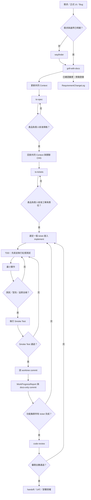

# AI 協作工程工作標準流程

> 本檔是專案唯一的 AI 工作標準來源，定義需求釐清、規格、工單、實作、審閱與交接的順序、授權閘門與完成條件。`AGENTS.md` 只能索引本檔，不得覆寫或建立競爭流程。

## 本次 Bootstrap 邊界

本次規範建立只可修改 `AGENTS.md`、`Workflow.md` 與 `CodeReview.md`；不得新增、複製、搬移或刪除其他檔案。此限制只適用於目前 Bootstrap 工作，並不否定未來在取得專案負責人明確授權後，依本流程建立正式專案產物。

<a id="workflow-flow"></a>

## 工作流程圖



主線不可跳過：

```text
wayfinder → grill-with-docs → CONTEXT.md → to-spec → 核准
→ 回掛 Context／CHG → to-tickets → 核准
→ implement（單一 ticket 的 TDD）→ commit → progress 記錄
→ code-review → handoff／UAT／部署授權
```

`RequirementChangeLog` 是已確認變更的旁路追溯，不取代 Context、SPEC、tickets、TDD 或任一核准閘門。

## 專案啟用與唯一來源

在任何實作前，專案負責人應指定下列唯一來源。未指定時，不得直接進入實作。

| 類別 | 唯一位置 | 用途 |
| --- | --- | --- |
| 工作流程 | `Workflow.md` | 工作順序、授權閘門與交付規則。 |
| Agent 入口 | `AGENTS.md` | 索引與啟動規則。 |
| Code Review 規則 | `CodeReview.md` | Code Review 的唯一實際驗證標準與結論依據。 |
| 需求變更 | `doc/RequirementChangeLog.md` | 已確認需求／正式 UI 的變更歷程。 |
| 專案事實 | `CONTEXT.md` | 系統地圖、已確認事實、邊界與待決事項。 |
| 規格 | `modules/spec/` | 已確認功能的唯一可驗收規格。 |
| 工單 | `modules/tickets/` | 垂直切片、責任與實作順序。 |
| Element 索引 | `modules/element/<language>/<feature>/<ticket-id>/` | 型別、契約、程式碼位置與測試證據索引。 |
| 交接台帳 | `doc/WorkProgressReport.md` | commit、驗證、簽署與 handoff。 |
| 安全邊界 | `doc/security-agent-boundary.md` | Secret、Log、Provider 與事故診斷規則。 |
| 審閱報告 | `doc/reviews/` | 功能集群的正式 code review。 |

完整文件結構僅能在取得明確授權後依 `template/README.md` 建立；固定正式位置是 `modules/spec/`、`modules/tickets/` 與 `modules/element/`，不得建立 `doc/specs/`、`doc/tickets/` 或平行來源。

<a id="discovery"></a>

## 1. 需求釐清：`wayfinder` 與 `grill-with-docs`

### 1.1 `wayfinder`

當產品目標、商業規則、優先順序、使用者流程、技術邊界或資料所有權尚不清楚時，先收斂並記錄：

1. 目標使用者、成功標準與本期不做範圍。
2. 已確認決策、限制、授權條件與既有事實。
3. 可立即決定的問題。
4. 未決問題、決策者、影響範圍與阻塞條件。
5. 需要的文件、資料、測試或外部確認。

`wayfinder` 只收斂問題，不授權實作。

### 1.2 `grill-with-docs`

新功能、跨模組變更、需求重定義或正式 UI 變更前，必須閱讀相關需求、既有規格、程式、測試、Context 與變更紀錄，並確認：

- 使用者可觀察結果、例外情境與驗收方式。
- 領域術語、資料所有權、資料流、保存與刪除限制。
- UI、API、背景工作、快取、資料庫、Provider、權限、成本與維運影響。
- 模組責任、依賴方向、Composition Root 與不可修改邊界。
- 替代方案、風險、回滾／forward-fix 與不做範圍。

完成後更新共同 `CONTEXT.md`；重大且難以回復的決策另以 ADR 留存。沒有明確授權時，只能提出草案或缺口，不能新增正式產物。

<a id="change-control"></a>

## 2. 變更控制

已確認需求、正式 UI、資料契約、權限、快取、Provider 或商業規則改變時：

1. 停止受影響實作與測試；未完成 ticket 標示 `BLOCKED`，被取代產物標示 `SUPERSEDED`。
2. 讀取 `RequirementChangeLog`，避免重複採用已否決或已被取代的方案。
3. 重新執行 `grill-with-docs` 並完成影響分析。
4. 以唯一 `CHG-YYYYMMDD-NNN` 旁路登錄原規則、變更後規則、決策理由、影響範圍、PRD 索引與關聯技術方案；SPEC 建立後回填完整 SPEC ID。
5. 更新 `CONTEXT.md`：移除失效事實，保留可追溯依據。
6. 重新走 `to-spec → 核准 → to-tickets → 核准`。
7. 若 SPEC 引用共同 Context，先由各檔案 owner 回掛 SPEC ID、路徑、收斂結果、責任邊界與關聯 CHG，並以 docs-only commit 形成共同基準。
8. 只清理被新版需求取代的測試；仍有效的安全、契約與回歸測試必須保留。

<a id="specification"></a>

## 3. `to-spec`：唯一可驗收規格

每個已確認功能集群只可有一份有效 SPEC，位置為 `modules/spec/<feature>.md`。SPEC 至少包含：

- `SPEC-<PROJECT>-<FEATURE>-<YYYYMMDD>-<ULID>`、狀態、撰寫 AI／worktree／基準 commit。
- Context、PRD、CHG 與共同 Context 回掛索引。
- 問題、目標使用者、成功標準與不做範圍。
- 使用者流程、資料流、錯誤與邊界行為。
- 領域模型、資料庫、快取、API／事件、UI、Provider、權限與維運影響。
- Composition Root、公開介面、依賴方向與責任邊界。
- 測試切點、驗收條件、風險、相容性、回滾／forward-fix 與部署前提。

SPEC 只能在產品負責人或使用者明確核准後進入 `APPROVED`。修訂追加修訂簽名；取代才建立新 SPEC 並標記舊 SPEC `SUPERSEDED`。ID 一經發布永不重用。

<a id="tickets"></a>

## 4. `to-tickets`：垂直切片與責任邊界

SPEC 核准且共同 Context 回掛完成後，才可建立 `modules/tickets/<feature>/`。每張 ticket 是可獨立驗證的使用者可觀察行為，禁止按前端、後端、資料庫或測試做水平切割。

每張 ticket 至少記錄：

- 對應完整 SPEC ID、章節與 AC；PRD、CHG、Context 與共同基準。
- `PLANNED`／`IN_PROGRESS`／`BLOCKED`／`DONE`／`SUPERSEDED` 狀態。
- owner、worktree、審閱者、環境、In Scope、Out of Scope 與依賴。
- 領域／應用／基礎設施／UI 影響、公開契約與實際原始碼位置。
- TDD 的正常、違規、外部失敗與回歸測試切點。
- 驗收方法、正式環境 SOP、回滾策略與完成回寫欄位。

`modules/element/<language>/<feature>/<ticket-id>/` 是索引與證據，不得複製正式原始碼；必須連結實際原始碼、領域型別、公開契約、TDD 與驗證結果。

工單與責任必須再次經明確核准。未核准前，不得修改正式程式、測試或 migration。

<a id="implementation"></a>

## 5. `implement`：逐張 ticket 的 TDD

一次只能實作一張已核准的 ticket。每個新行為依序：

1. 在已同意的測試切點寫可執行測試。
2. 執行並確認測試因行為尚未實作而失敗（紅燈）。
3. 僅寫足以讓測試通過的最小正式原始碼。
4. 執行受影響測試、型別檢查、lint、格式化、建置與資料驗證；全綠後進入 Smoke Test 閘門。

### Smoke Test 閘門

每張已核准 ticket 完成上述驗證後，必須先對本次異動的主要使用路徑執行 smoke test；通過前不得進入下一個行為、下一張 ticket、commit 或其他工作。

- 依變更型態確認服務或應用可啟動、入口可使用，並驗證至少一條核心使用路徑得到預期結果。
- 同時確認沒有明顯的執行期錯誤、失敗回應或資料載入問題；無法自動化的檢查須記錄手動步驟與結果。
- 失敗時回到 TDD／實作流程修正並重新驗證；通過後，將執行方式與結果記入 ticket 或 `WorkProgressReport.md`，才可繼續下一項工作。

### 型別與分層

- 使用明確領域型別、不可變資料模型、顯式 nullability 與完整參數／回傳型別。
- 禁止 `Any`、隱含 `any` 或動態型別掩蓋資料不一致；例外必須縮小範圍並記錄原因。
- Python 使用 `mypy --strict` 或 Pyright strict；Node.js 使用 TypeScript strict；其他語言遵循等價的強型別與審計規範。
- Domain 僅含不變量、值物件、狀態與商業規則；Application 負責 use case、port 與交易邊界；Infrastructure 實作 DB／Cache／Queue／Provider adapter；Transport／UI 負責 HTTP、Webhook、LIFF／Web UI 與序列化。外層不得承載商業規則或 Secret。

### 單張 ticket 完成條件

1. TDD 與受影響回歸測試全綠。
2. 型別、lint、格式化、建置與資料驗證通過；未執行項要有阻礙與核准者紀錄。
3. 驗收條件、錯誤處理、資料契約、隱私與日誌規則均有可重現證據。
4. 由 owner worktree 建立只含該 ticket 的 commit。
5. 在 `WorkProgressReport` 登錄完成資訊後，再由同一 worktree 建立獨立 docs-only commit。

<a id="collaboration"></a>

## 6. 多 AI／多 worktree 協作

開始任何功能集群前，所有 Agent 必須讀取有效 SPEC、tickets、共同 Context、需求變更與進行中 worktree Context，區分：

1. 已 `APPROVED`、不可自行改寫的規則與契約。
2. 已 `SUPERSEDED`、`BLOCKED` 或僅供歷史參考的產物。
3. 尚未確定、使用者明確變更或已確認失效的範圍。

只可針對第 3 類重新走 `grill-with-docs → to-spec → to-tickets`。

- 每個進行中的檔案與 ticket 只能有一個 owner worktree。
- Agent 只能在自己的 worktree 寫檔、stage、commit、merge、rebase、pull、push、stash 或切換分支。
- 其他 Agent 可讀、評論或建立 review 報告，但不得跨 worktree 替實作者修改或提交。
- Composition Root、migration、共享契約或同一設定檔有衝突時，建立先行整合 ticket，或由指定整合者串行處理。
- handoff／merge 前，必須核對 Context、tickets、elements、資料模型、API／事件、Provider、快取、測試與實際 diff；任一衝突未解即為 `BLOCKED`。

<a id="security"></a>

## 7. 安全、Secret 與正式 Log

- Agent 不得接收、輸出或儲存明文 Secret。
- 金鑰只經 KMS、Secret Manager 或 Tool Gateway 操作；Agent 只能使用 alias、key ID、版本與去識別化錯誤。
- 正式 Log 必須 redact／sanitize，且以唯讀方式查詢；不得暴露 Authorization header、Cookie、Token、精確位置或正式使用者資料。
- 任何 Secret、KMS、正式 Log、事故診斷、管理權限、付費 Provider 或安全例外，先查安全邊界文件並通過需求、規格與工單閘門。
- 外部 Webhook 必須驗簽、去重、限流與 fail-closed；所有前端輸入都由伺服器重新驗證與正規化。

<a id="review-handoff"></a>

## 8. Code Review、交接與部署

功能集群所有 ticket 各自完成 commit 且通過 Smoke Test 後，才可 code review。Code Review 的實際行為、驗證項目、證據與結論，唯一依據 [CodeReview.md](CodeReview.md)；不得以口頭、聊天或其他文件中的自訂標準取代。

審閱者須依 `CodeReview.md` 逐項評估，將每項發現、驗證證據與結論記入 review report，並確認其對應的 spec、ticket、測試、實作與 `CONTEXT.md` 可相互追溯。

所有發現修正、驗收證據完整，且 review 報告結論為 `APPROVED` 後，功能集群才可標示 `READY_TO_MERGE`。

交接必須可獨立回答：

1. 對應哪一份 SPEC、ticket 與 CHG？
2. 完成與未完成內容、實際改動檔案為何？
3. TDD、測試、型別、建置與 review 的證據是什麼？
4. 哪個 worktree、commit 與責任人完成？
5. 對前端、後端、資料、快取、API、安全、成本與維運的影響？
6. 已知限制、殘餘風險、回復方式與下一張 ticket？

無法回答任一項，交接狀態為 `BLOCKED`，不得標示 `DONE`。

部署、付費、外部權限調整、資料刪除、正式 Secret 使用與冷備份都需要使用者或指定責任人的明確、範圍化授權。冷備份不得含 `.env*`、Secret、正式資料、`.git` 或可重建大型產物，並須記錄版本、時間、SHA-256、Git HEAD、封存範圍、排除項與還原說明。
