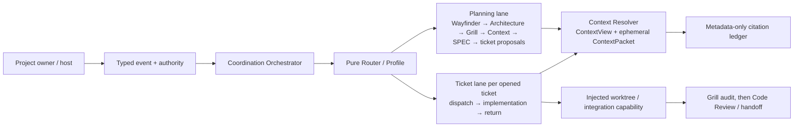

# ADR-20260805-002｜Autonomous multi-AI collaboration control-plane architecture

- 日期：`2026-08-05（Asia/Taipei）`
- 狀態：`ACCEPTED — Grill converged`
- 架構產出者：Codex control plane
- 決策授權：`CHG-20260805-010`；Grill 已於 `2026-08-05` 收斂
- 關聯規格：`SPEC-AI-WORKFLOW-AUTONOMOUS-COLLABORATION-AUDIT-20260805-01KZ7A2C4E6G8J0L2N4P6R8T`
- 關聯需求變更：`CHG-20260805-010`
- 共同 Context：`doc/context/autonomous-collaboration-audit/main.md`

## 背景與問題

本專案的現行目標是可拔除的多 AI 協作／稽核控制平面。使用者保有模型、對話、Git repository 與工作區；本專案不能成為被接管專案的 runtime、CI、hook、submodule、symlink 或原始碼依賴。

一個單一 `ProjectRouter` stage 無法同時表達「控制面繼續 Grill 下一個問題」和「另一位 implementation owner 正在實作已交付 ticket」。現有 Router POC 的 `RouterEngine`、`ContextResolver` 和 Profile 是可沿用的單線、metadata-only 基礎，但不足以直接宣稱已具有多 lane、worktree 管理或自動整合能力。

## 架構決策

採用一個本機、metadata-only 的協調控制平面。它由純 Router 決策、兩種隔離 lane、最小 Context 邊界與可替換的 host／Git adapter 組成；它不直接執行模型、讀取未宣告文件、建立 host thread 或執行真實 Git 命令。



### 1. Router 與協調層

- `RouterEngine` 仍只根據強型別 state、event、Profile 產生唯一 `RouterDecision`；它不得讀取原文或自行執行 Agent、Git、MCP 或 host 操作。
- 新的協調層只編排已驗證的 metadata event，建立／更新 lane descriptor，並把每個決策交給 allowlisted capability。它不得把聊天文字、prompt、檔案路徑、URI、Secret、PII 或 `ContextPacket` 放入 state、checkpoint、Temporal history、event record 或 handoff。
- 目前的單線 Router Profile 是相容性基礎。多 lane 與 dispatch 的公開型別、轉移與測試必須由 ticket 01 明確新增；在它完成前，不得把舊 `TICKETS + APPROVAL_GRANTED` 視為新流程已實作。

### 2. 兩種 lane 與唯一 owner

| Lane | 擁有者 | 最小狀態 | 不可做的事 |
| --- | --- | --- | --- |
| Planning lane | control-plane owner 的 `main` worktree | `project_id`、delivery stage、topology、正式 artifact refs、active ticket refs | 變更已交付 ticket 的 scope、讀取 ticket 的 raw ContextPacket、代表 implementation owner 寫程式 |
| Ticket lane | 該 ticket 的具名 implementation owner／獨立 worktree | ticket ref、dispatch state、expected main revision、owner/reviewer、correlation ID、artifact refs | 寫 control-plane 的 `main` worktree、改變需求／架構／公開契約、將原文 Context 回傳 |

一張 `PLANNED` proposal 在被開立時立即成為 `IN_PROGRESS`，但其 `dispatch_state` 仍可為 `AWAITING_CONFIRMATION`；這表示 ticket 已被控制面追蹤，並不表示未確認交付時可以實作。正面交付確認同時是該張 ticket 的唯一 scoped implementation authority，接著 ticket lane 才取得 `IMPLEMENT` 途徑。

### 3. 事件、等待與自動延續

目標事件面至少需要 topology 選擇、ticket 開立、dispatch 確認、implementation return、integration 完成與 audit 完成等強型別事件。每個 event 必須有唯一 correlation ID，且只作用於指定 lane。

- `WAIT_FOR_HUMAN` 僅用於 topology 選擇、SPEC 核准、具名 ticket 的交付確認，以及真正不可逆的外部操作。
- 沒有 implementation return 時，planning lane 是「等待受訂閱的自動事件」，不是 `WAIT_FOR_HUMAN`；一旦 return 到達，協調層重新評估依賴 proposal。
- 缺少 artifact、owner、authority、capability、有效 correlation、乾淨基準或驗證證據時，路徑必須 `HALT`。它不得猜測、使用舊 Profile fallback 或把技術失敗偽裝成人類等待。

### 4. Context 與資料邊界

`ContextView` 僅保存正式來源的 revision／span、token budget、side-context ID、target artifact 與 consumer fingerprint。`ContextResolver` 在消費者工作區暫時組成 `ContextPacket`，任務結束即關閉或失效引用。下一次引用使用新的 event／side-context ID；Agent 本地工作區只可保留其實際讀過原文的紀錄與 metadata mapping。

Planning lane 與 Ticket lane 必須有不同的 ContextView、consumer fingerprint、event ID 與 safety ceiling。任一 lane 不得藉由 shared Context、checkpoint 或 handoff 取得另一 lane 的原文。

### 5. 外部能力與整合邊界

worktree provisioning、local-main integration、lock、模型執行與 host conversation 都是 injected port，不是 Router 的內建權力。

- Ticket 01 只產生／驗證 worktree plan descriptor 與 dispatch receipt；它不建立實體 worktree 或呼叫 Git。
- Ticket 02 才加入受 lock 保護的 integration port，POC 僅使用 deterministic fake adapter。它必須在 matching revision、乾淨狀態、無衝突、無重複 correlation 且持有 lock 時才可模擬一次 integration。
- integration 成功後，`main` 為 `PENDING_AUDIT`；不得 push、deploy、handoff 或啟動依賴 ticket。Grill audit 通過後才能進入既有 Code Review／handoff 路徑。Grill audit 不取代 Code Review。

## 目標流程

```text
Wayfinder GO
  → Architecture handoff (this ADR)
  → Grill
  → Context → SPEC approval → ticket proposals

open proposal
  → ticket = IN_PROGRESS + dispatch_state = AWAITING_CONFIRMATION
  → one named delivery-confirmation question
  → confirmed dispatch
      ├─ ticket lane: IMPLEMENT → verification → typed return
      └─ planning lane: next Grill

valid completed return
  → guarded local-main integration → PENDING_AUDIT
  → Grill audit → Code Review → handoff
```

## 替代方案與取捨

| 替代方案 | 決定 |
| --- | --- |
| 將 planning 和 implementation 強制留在單一 stage／單一 worktree | 拒絕：無法表達並行責任，且有 Git owner 衝突。 |
| 讓每個 Agent 自行管理 Context 和下一步 | 拒絕：會膨脹 shared context，且無法統一失效、預算與 fail-closed。 |
| 由 Router 直接建立 host thread、選模型、呼叫 Git | 拒絕：超出 plugin／host 權限並破壞可拔除邊界。 |
| metadata-only Router + injected external ports | 採用：可測試、可拔除且保留 host／Git 權限邊界；代價是實際外部操作須由後續受控 adapter 實作。 |

## Grill 必答問題

1. Planning lane 與 Ticket lane 是否能在任何 event、ContextView、artifact grant 或 owner 上互相污染？
2. 「ticket 已 `IN_PROGRESS`、但尚未交付」是否在程式與文件上都無法取得 source／capability／worktree grant？
3. implementation return 的 `COMPLETED`、`BLOCKED`、`CHANGE_DETECTED` 是否都能被唯一且 fail-closed 地處理？
4. `PENDING_AUDIT` 是否確實阻擋 push、deploy、handoff 與 dependent implementation，並保留 Code Review 作為獨立驗證？
5. 真實 Git、host thread、模型執行與原文 Context 是否都留在 injected／ephemeral 邊界，而非被 POC 假裝自動完成？
6. 目前已在執行的 ticket 01 能否在不擴張 scope 的情況下實現第一段契約；若不能，是否必須以 `REQUIREMENT_CHANGED` 回流？

## 後果、風險與回復方式

- 這份 ADR 補足 Architecture stage，不會自行修改已交付 ticket 01 的 scope，也不授權新的 source/test 實作。
- 若 Grill 判定 architecture 與已核准 SPEC／ticket 衝突，必須建立 `REQUIREMENT_CHANGED` 並停止受影響的後續整合；不得以聊天或局部 patch 修正。
- 若 Grill 通過，ADR 成為 `ArtifactKind.ARCHITECTURE` 的正式輸入，之後才可產出新的 Grill Context／SPEC 修訂或確認既有 SPEC 可沿用。
- 回復方式是撤銷本 ADR 的 proposed decision，回到 Wayfinder／Architecture 重新產出；它沒有 runtime、資料或 target-project 回復成本。

## 修訂／淘汰紀錄

- 初版：補足 `CHG-20260805-010` 被跳過的 Architecture handoff，等待 Grill。
- `2026-08-05`：Grill 確認兩 lane、metadata-only Context、injected external ports 與 audit-before-review 的方向；AC-11 event wake 與 Code Review gate 由 ticket 02 承接。既有 ticket 01 範圍不擴張。
