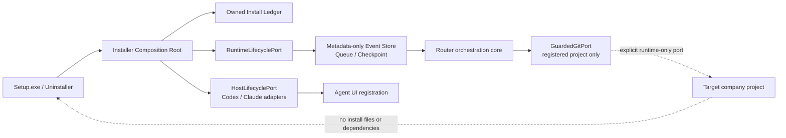

# ADR-20260808-003｜Installer-owned local orchestration with reversible host lifecycle

- Date: `2026-08-08（Asia/Taipei）`
- Status: `ACCEPTED for POC architecture; implementation remains subject to SPEC approval`
- Decision maker: Project owner
- Related specification: `SPEC-AI-WORKFLOW-LOCAL-ORCHESTRATION-INSTALLER-20260808-01KZ8L0C2E4G6J8M0P2R4T6V8X` (`DRAFT`)
- Related change: `CHG-20260808-011`

## Background and problem

The plugin is intended to be detachable. Manual marketplace installation alone cannot prove which local payload, runtime state or host registration belongs to it. The owner requires one normal uninstall action to remove plugin content while preserving every target company project. The earlier autonomous-collaboration POC deliberately used fake external ports and must not be misrepresented as an installable local runtime.

## Decision

Implement the future POC as a Windows per-user package with a paired installer and uninstaller, an installer-owned root and a local ports-and-adapters runner.

1. `Setup.exe` uses no administrator elevation and installs only beneath the fixed `%LOCALAPPDATA%\\JohnnyAIWorkflow` per-user owner root. The exact root is a typed configuration value, not an arbitrary input path.
2. The ledger is created atomically with a random installation ID, a versioned manifest of relative owned paths/digests and reversible host-registration receipts. It is the sole authority for update and removal.
3. `HostLifecyclePort` has capability methods for detect, register and unregister. A host registration may be made only if all three actions are supported and the adapter returns a receipt proving ownership. Removal must return proof that its receipt-owned registration and any receipt-owned host payload are gone. `FOREIGN`, unavailable, unauthenticated or unremovable host state blocks installation and triggers cleanup of staging content.
4. The local runner stores only typed metadata events and checkpoints inside the root. Raw ContextPackets, source text, prompts, project paths/URIs, credentials and PII are excluded from models and persistence. It can resume a safe Router continuation but cannot force a Codex/Claude conversation or model turn.
5. A guarded Git port is separate from installer authority. It maps a validated opaque `ProjectId` to a pre-registered local root only within its injected adapter and requires exact base, clean tree, lock and fast-forward-only conditions. It cannot run during install/uninstall.
6. Uninstall verifies the ledger and every deletion candidate before stopping the owned process, unregistering each receipt and deleting the owned root. It may remove only verified descendants. It is idempotent for absent installs. Any failure gives `UNINSTALL_BLOCKED`, retains owned recovery state and reports no false success.

## Alternatives and trade-offs

| Alternative | Decision |
| --- | --- |
| Copy workflow files into each company project and rely on `.gitignore` | Rejected: still creates project coupling and cannot guarantee cleanup. |
| Delete by product name from host/cache directories | Rejected: a same-named manual or future installation may be foreign. Ownership must be receipt and manifest based. |
| Give the installer a blanket filesystem/Git authority | Rejected: violates detachability and makes target-project protection untestable. |
| Treat the current fake Router ports as a real orchestration service | Rejected: would falsely claim host/Git behavior that has not been implemented or verified. |
| Installer-owned root + reversible host adapters + injected runtime ports | Adopted: supports one-click normal removal while preserving host and project authority boundaries. |

## Consequences, risks and recovery

- The packaging build requires a pinned Windows installer toolchain. The workspace currently has no Inno Setup/NSIS compiler, so binary production is not claimed until an approved ticket supplies and validates it.
- A host that cannot be cleanly registered and unregistered cannot be offered by this POC. This is intentionally a product limitation, not a hidden manual-cleanup burden.
- A corrupted ownership ledger may block uninstallation; it cannot authorize broad deletion. Recovery is to repair/remove only the explicitly displayed installer-owned root after independent verification, never a target project or generic host cache.
- Updating an owned installation must create a new staged manifest and atomically replace only the existing same-installation root; it must not take ownership of a foreign installation.
- Reversal is a forward fix: remove this POC's installer/runtime commits. No target-project migration, repository rewrite or deployment rollback exists.

## Revision history

- Initial architecture for `CHG-20260808-011`, derived from the accepted Wayfinder functional map and passed to Grill.
