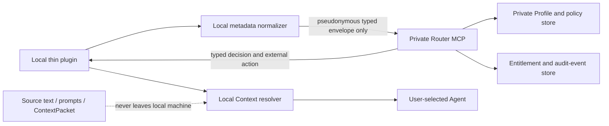

# Private Router SaaS POC Context

| Field | Value |
| --- | --- |
| Feature cluster | `private-router-saas` |
| Agent / worktree | Codex / current worktree |
| Shared baseline | `cbdfa7751c21c0355cb3aaaae5b7f045d9e84154` |
| State | `TICKETING` |
| Responsibility boundary | Private Router SaaS POC contracts, local privacy boundary, private-decision architecture, and user-facing terminology mapping |
| Prohibited changes | No production billing, model hosting, raw-content upload, company-project runtime dependency, external deployment, or change to existing approved Router POC behaviour |

## Shared Context Reference

- Shared baseline commit: `cbdfa7751c21c0355cb3aaaae5b7f045d9e84154`
- `CONTEXT.md` section: `已確認事實與共同邊界`
- Reference anchor: `已確認事實與共同邊界`
- Reference fingerprint: `6dc4857b`

## Existing Specification Prerequisite Check

| Artifact | State | Reusable / immutable boundary | Disposition |
| --- | --- | --- | --- |
| `modules/spec/router-framework.md` | `APPROVED` | Local, pure Router contracts, local fake source, and metadata-only Context references | Reuse as a compatibility baseline; do not alter its approved POC behaviour in this feature |
| `modules/spec/context-load-telemetry.md` | `APPROVED` | Local metadata-only evidence; no raw source, prompt, URI, or company code | Reuse its data-minimisation boundary; do not export its JSONL to the SaaS |
| `modules/spec/plugin-distribution.md` | `APPROVED` | Detachable Codex plugin distribution; no target-project dependency | Evolve only through this new feature's approved contract; preserve detachability |

## Wayfinder Decision

```json
{
  "project_id": "private-router-saas-poc",
  "decision": "GO",
  "decision_reasons": [
    "The POC can validate private Router decisions with strongly typed metadata contracts while keeping source text, prompts, paths, URIs, and ContextPacket data on the user's machine.",
    "The existing Router POC supplies typed state, event, decision, ContextView, citation, and fail-closed boundaries that can be extended without coupling any target project to the service.",
    "The POC defers real billing, deployment, model execution, and customer launch; these are MVP or commercial gates after separate approval."
  ],
  "product": {
    "target_users": [
      "Users without an engineering background who use vibe coding to build products",
      "Users who need an inherited-project audit, repair path, or deployment-ready route"
    ],
    "core_problem": "A static workflow skill exposes its core rules, can be skipped by an Agent, and cannot consistently select bounded Context or enforce a safe next action.",
    "value_proposition": "A detachable local plugin obtains a private Router decision for the next permitted product action without uploading project source or shared Context.",
    "mvp_scope": [
      "First-project free entitlement, standard project route, and inherited-project audit route",
      "OAuth-authenticated private Router MCP with persistent entitlement and audit events",
      "A user-facing workflow that exposes clear actions but not internal Router terminology or Profile logic"
    ],
    "out_of_scope": [
      "Running or paying for a user's model",
      "Raw code, raw document, prompt, path, URI, secret, PII, or ContextPacket upload",
      "A promise of SLA, target-project runtime dependency, automatic production deployment, or payment processing in the POC"
    ]
  },
  "business": {
    "model": "Private Router SaaS. The first registered project is free; the standard route is NT$690 per month from the second project; one active inherited-project audit route is NT$2,000 per month.",
    "validation_method": "After MVP billing is approved, validate five independent active paid users and at least three second-cycle renewals while recording no raw project content.",
    "success_metrics": [
      "Five active paid users",
      "At least three second-cycle renewals",
      "No raw source, prompt, path, URI, secret, or PII accepted or persisted by Router SaaS contracts",
      "Each paid Router decision is fail-closed when entitlement, approval, or required metadata is absent"
    ],
    "stop_conditions": [
      "The privacy boundary cannot be technically validated without importing project content",
      "The service's directly attributable monthly cost exceeds 30% of the applicable plan revenue",
      "The Router cannot produce a single typed next action from validated state, event, and Profile inputs"
    ]
  },
  "constraints": {
    "tech_limits": [
      "Users bring their own Codex or Claude model subscription and model usage",
      "The service receives only pseudonymous metadata, revision fingerprints, typed stage events, and locally redacted structured summaries",
      "The POC uses fake entitlements and a non-production transport; production payment, OAuth provider, database, and hosting require a later MVP change"
    ],
    "cost_ceiling": "Direct monthly cost per active standard user must not exceed NT$207; per active audit user must not exceed NT$600. POC has no paid provider or cloud deployment."
  },
  "risks": [
    {
      "risk": "Metadata and summaries cannot prove that a local client truthfully described a project.",
      "mitigation": "Treat remote decisions as control-plane guidance only; validate every envelope strictly, require local evidence status, and fail closed on missing or inconsistent fields."
    },
    {
      "risk": "A hash is pseudonymous, not automatically anonymous, particularly for low-entropy content.",
      "mitigation": "Use account-scoped random identifiers and salted revision digests; never transmit paths, URIs, filenames, raw content, or unsalted content hashes."
    },
    {
      "risk": "Users can disable the plugin or use another AI tool.",
      "mitigation": "Do not claim platform-wide enforcement. The private Router fail-closes only the product's own gated capability path."
    }
  ],
  "assumptions": [
    "The project owner selected a private Router SaaS rather than a local-only perpetual-license product on 2026-08-04.",
    "External terminology may abstract internal stages, but privacy, payment, permission, and user-impact disclosures remain clear.",
    "The named prices are product hypotheses; no real charge occurs before the MVP billing gate."
  ]
}
```

## High-Level Architecture



- The local plugin owns source access, redaction, local ContextPacket construction, and the local evidence needed by the Agent.
- The private service owns Profile versions, private decision logic, user-facing action mapping, entitlement state, and metadata-only audit events.
- The service response contains only a typed decision, action label, permitted capability identifiers, source *kinds*, Context budget, blockers, and opaque reference identifiers. It never returns Profile source, scoring rationale, or raw source selection text.
- Existing `RouterEngine`, `ContextView`, and citation mapping are compatibility inputs. The current implementation is not the SaaS runtime: it has only four POC transition rules, no actual Agent dispatcher, a non-enforced fixed Context budget, and a local-only source gateway.

## Grill Results

| Question | Confirmed result / control |
| --- | --- |
| What crosses the trust boundary? | Only strict pseudonymous metadata, salted revision digests, stage events, entitlement mode, and redacted structured summary fields. Unknown fields and free-form content fail closed. |
| Where can raw content exist? | Only in the local source adapter, temporary local `ContextPacket`, and the consuming Agent worktree. It must not enter requests, responses, service logs, database rows, checkpoints, or telemetry. |
| What does “enforcement” mean? | The product's Router path blocks itself without valid entitlement, input, approval, or capability. It cannot prevent a user from disabling the plugin or using unrelated software. |
| What is the POC payment boundary? | Fake typed entitlements only. Real checkout, payment provider credentials, webhook verification, refund, tax, and customer launch are not in scope. |
| How is internal logic protected? | Private Profile and policy evaluation run only in the service. User-facing labels do not disclose internal stages, names, scoring, or transition tables. Naming is not treated as a security boundary. |
| How is detachability retained? | No target-project source, configuration, CI, runtime, or deployment depends on the plugin or service. Removal only removes the workflow guidance and Router path. |

## User-Facing Terminology Boundary

| Internal concept | User-facing label |
| --- | --- |
| `WAYFINDER` | 專案起點 |
| `ARCHITECTURE` | 建置藍圖 |
| `GRILL` | 準備度檢查 |
| `CONTEXT` | 工作資料範圍 |
| `SPEC` | 功能藍圖 |
| `TICKETS` | 執行清單 |
| `IMPLEMENT` | 開始建置 |
| `REVIEW` | 品質確認 |
| `HANDOFF` | 發布準備 |

## Pending Cross-Cluster Decisions

- MVP must select a payment provider, OAuth identity provider, database/hosting region, retention period, deletion process, and a legally reviewed privacy/refund policy. These are blocked pending a new MVP Wayfinder and change.
- The owner must explicitly approve `modules/spec/private-router-saas.md` before tickets or implementation are created.

## Derived Specification Index

### `SPEC-AI-WORKFLOW-PRIVATE-ROUTER-SAAS-20260804-01KZ49YM6HA658QF7ME2A5BR26`｜Private Router SaaS POC

- Specification path: `modules/spec/private-router-saas.md`
- Dedicated Context: `doc/context/private-router-saas/main.md`
- Shared Context reference: `CONTEXT.md › 已確認事實與共同邊界`, fingerprint `6dc4857b`, baseline `cbdfa7751c21c0355cb3aaaae5b7f045d9e84154`
- Convergence: private typed Router decision service with source-local Context resolution; no billing, raw-content transfer, model hosting, or production deployment in the POC.
- Responsibility boundary: POC contracts and in-process/private-transport validation only; no target-project change or commercial operation.
- PRD / change: `PRD.md §12` / `CHG-20260804-008`
- Shared Context backlink state: `SPEC_APPROVED_PENDING_DOCS_BASELINE`
